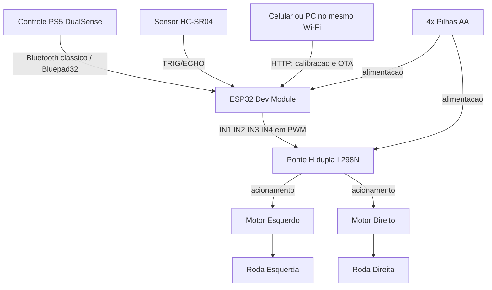
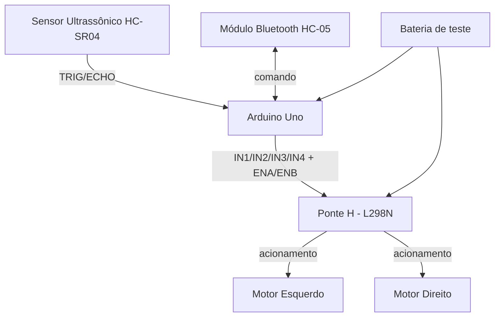

# Carrinho Robótico WALL-E


## Identificação Acadêmica

- **Turma:** 4ESPY
- **Avaliação:** CP1
- **Alunos:**
  - Julia Azevedo Lins — RM 98690
  - Luis Gustavo Barreto Garrido — RM 99210
  - Victor Hugo Aranda Forte — RM 99667
  - Felipe Cortez — RM 99750
  - Guilherme Akio — RM 98582

---

## 1. Título do Projeto

**Carrinho Robótico WALL-E** — Projeto de carrinho robótico físico e funcional, com carenagem estética inspirada no personagem WALL-E (filme *WALL-E*, Pixar).

---

## 2. Descrição do Projeto

O projeto **Carrinho Robótico WALL-E** consiste em um carrinho robótico físico e funcional, desenvolvido na disciplina de Project-based Maker Lab. O robô é construído sobre um corpo impresso em 3D inspirado no personagem WALL-E (Pixar), movimenta-se por meio de duas rodas acionadas por motores DC independentes, é comandado à distância por um controle **PS5 DualSense** via Bluetooth e detecta obstáculos com um sensor ultrassônico **HC-SR04**, que bloqueia automaticamente o avanço diante de uma colisão iminente.

O projeto atravessou três etapas: concepção e ficha de requisitos (seções 1 a 19), montagem e testes de bancada (seções 20 e 21) e integração da versão final entregue (seções 23 a 28).

---

### Como ler este documento

Este documento é **cumulativo**: ele preserva o registro de cada etapa, inclusive das decisões que foram depois revistas, porque a evolução do projeto faz parte da entrega.

| Seções | O que contêm | Status |
|---|---|---|
| 1 a 19 | Concepção inicial, ficha de requisitos, croqui | Atualizadas para a versão final; onde a concepção foi superada, o texto indica o que mudou e por quê |
| 20 e 21 | Montagem de bancada e testes com Arduino Uno | **Registro histórico** — não descrevem o robô entregue |
| 23 a 28 | Versão final: modelagem 3D, eletrônica, firmware, testes, uso e evidências | **Descrevem o robô entregue** |

Em caso de divergência, **valem as seções 23 a 28**.

---

## 3. Objetivo

Desenvolver um carrinho robótico funcional, inspirado visualmente no personagem WALL-E, capaz de:

- Movimentar-se por meio do acionamento dos motores, permitindo deslocamento para frente, para trás e curvas;
- Receber comandos de um controle remoto sem fio;
- Detectar obstáculos por meio de um sensor de distância;
- Apresentar uma carenagem externa que remeta às características visuais do personagem que inspira o projeto.

---

## 4. Escopo

O escopo do projeto compreende o robô completo, entregue e funcional:

- Ficha de requisitos, requisitos funcionais e físicos;
- Projeto mecânico: adaptação, modelagem e impressão 3D do corpo, das peças de acoplamento e da roda boba;
- Montagem elétrica: microcontrolador, ponte H, motores, sensor e alimentação por pilhas;
- Firmware do ESP32: controle diferencial dos motores, comunicação sem fio com o controle PS5 e leitura do sensor de distância;
- Testes funcionais de locomoção, comunicação remota e detecção de obstáculos;
- Documentação de todo o processo neste repositório.

Não fazem parte do escopo: navegação autônoma (o robô só se move sob comando do controle), mapeamento de ambiente e uso de bateria recarregável.

---

## 5. Ficha de Requisitos

A tabela abaixo apresenta a **ficha final**, com o que foi planejado e o que efetivamente ficou no robô entregue.

| Item | Planejado (concepção) | **Final (entregue)** |
|---|---|---|
| Dimensões do corpo | 220 × 140 mm, altura 35 mm | **204,4 × 126,0 × 77,7 mm** |
| Quantidade de motores | 2 motores DC com caixa de redução | 2 motores DC TT com caixa de redução ✔ |
| Configuração de tração | 2WD (tração diferencial) | 2WD diferencial ✔ |
| Placa controladora | ESP32 | ESP32 Dev Module ✔ |
| Driver de motores | TB6612FNG | **Ponte H dupla L298N** (ver nota) |
| Sensor de distância | HC-SR04 | HC-SR04, frontal ✔ |
| Elemento de tração | 2 rodas motrizes | 2 rodas motrizes de borracha, acopladas por extensor de eixo ✔ |
| Roda de apoio | 1 roda caster | Roda boba traseira modelada pela equipe ✔ |
| Alimentação | Pilhas não recarregáveis, posição central/inferior | 4 × pilhas AA em suporte com chave liga/desliga |
| Controle remoto | Sem fio, via recursos do ESP32 | **Controle PS5 DualSense**, Bluetooth clássico via Bluepad32 |
| Material do chassi | Impressão 3D | Impressão 3D em PLA ✔ |
| Material da carenagem | A definir | **Não há peça separada** — o corpo impresso é chassi e carenagem |

> **Nota sobre a ponte H.** O firmware oficial aciona os motores por **quatro entradas de controle com PWM direto** (`IN1`–`IN4`), sem pinos de *enable* ou *standby* separados. Essa é a ligação típica de um **L298N** com os jumpers ENA/ENB fechados — módulo já validado na montagem de bancada (seção 20) e presente na planilha de custos. Um TB6612FNG exigiria a topologia `PWMA`/`AIN1`/`AIN2`/`STBY`, que **não** corresponde ao código entregue. Caso a equipe tenha substituído o módulo na montagem final, basta atualizar esta linha e a tabela de pinagem da seção 24.2 — a lógica do firmware não muda.

---

## 6. Requisitos Funcionais

| Código | Descrição |
|---|---|
| RF01 | O robô deve movimentar-se para frente. |
| RF02 | O robô deve movimentar-se para trás. |
| RF03 | O robô deve realizar curvas para a esquerda e para a direita utilizando controle diferencial dos motores. |
| RF04 | O robô deve receber comandos de um controle remoto sem fio. |
| RF05 | O robô deve detectar obstáculos utilizando um sensor de distância. |
| RF06 | O sistema deve ser capaz de interromper ou modificar o movimento quando um obstáculo for detectado a uma distância previamente definida. |

---

## 7. Requisitos Físicos

| Código | Descrição |
|---|---|
| RFIS01 | O chassi deve possuir aproximadamente 220 × 140 mm. |
| RFIS02 | O chassi deve ser produzido por impressão 3D. |
| RFIS03 | O chassi deve possuir espaço para acomodar os componentes eletrônicos. |
| RFIS04 | O chassi deve permitir a fixação dos dois motores. |
| RFIS05 | O chassi deve permitir a instalação das duas rodas motrizes e da roda caster. |
| RFIS06 | A carenagem deve ser fixada sobre o chassi sem impedir o acesso aos componentes para manutenção. |

---

## 8. Especificações Técnicas

### 8.1 Parâmetros definidos

- **Placa controladora:** ESP32 Dev Module — processa os comandos, aciona os motores, mantém a comunicação sem fio e lê o sensor de distância. Exige chip com **Bluetooth clássico**; variantes somente-BLE (S2, S3, C3, C6) não funcionam com a biblioteca utilizada;
- **Driver de motores:** ponte H dupla com quatro entradas de controle (L298N), acionada por PWM direto nas quatro entradas;
- **Sensor de distância:** HC-SR04, montado na face frontal do corpo;
- **Configuração de tração:** 2WD diferencial — cada roda lateral é acionada por um motor independente;
- **Comunicação:** Bluetooth clássico com controle PS5 DualSense, via biblioteca **Bluepad32**;
- **Rede Wi-Fi (auxiliar):** o ESP32 também se conecta a uma rede Wi-Fi para permitir atualização de firmware por **OTA** e uma **página web de calibração** dos motores.

### 8.2 Parâmetros definidos durante a execução

Os parâmetros abaixo estavam pendentes na concepção e foram **fechados durante a implementação**. Os valores são os que estão efetivamente no firmware entregue (`Códigos/PS5_ESP32_Bluepad32.ino`).

| Parâmetro | Valor final | Onde foi definido |
|---|---|---|
| Alimentação | 4 × pilhas AA alcalinas, suporte com chave liga/desliga | Planilha de custos |
| Modelo dos motores | Motor DC TT 3–6 V com caixa de redução, eixo duplo | Planilha de custos |
| Elemento de tração | 2 rodas de borracha acopladas ao eixo do motor pelo extensor impresso | Montagem final |
| Roda de apoio | Roda boba de 86 × 36 × 15 mm, modelada pela equipe | Modelagem 3D |
| Controle remoto | PS5 DualSense, Bluetooth clássico | Firmware |
| Distância de detecção | **20 cm** (`DISTANCIA_MIN_CM`) | Firmware |
| Alcance útil do sensor | ~2,5 m (timeout de 15 ms no `pulseIn`) | Firmware |
| Frequência de leitura do sensor | 1 leitura a cada 60 ms | Firmware |
| Velocidade máxima | PWM 200/255 no arranque, ajustável de 80 a 255 pelos gatilhos R2/L2 | Firmware |
| Frequência do PWM | 1 kHz, resolução de 8 bits | Firmware |
| Zona morta dos analógicos | 80 unidades (~15% do curso do stick) | Firmware |
| Rampa de aceleração | Incremento de 12 unidades a cada 15 ms | Firmware |
| Peso e autonomia | Não medidos — ver seção 25.4 | — |

---

## 9. Lista de Componentes

| Componente | Qtd. | Função | Origem |
|---|---|---|---|
| Corpo do WALL-E impresso em 3D | 1 | Estrutura e carenagem, em peça única | Impresso (PLA) |
| Roda motriz de borracha | 2 | Elemento de tração, acoplada ao eixo do motor | Comercial |
| Conjunto lateral (track frame + roletes) | 2 | Apoio do robô no piso e elemento visual das esteiras | Impresso |
| **Extensor de eixo** | 2 | Acopla o eixo do motor à roda dentada | **Modelado pela equipe** |
| **Roda boba (caster)** | 1 | Terceiro ponto de apoio, traseiro | **Modelada pela equipe** |
| **Travessa interna** | 1 | Alinha e sustenta os motores dentro do corpo | **Modelada pela equipe** |
| Motor DC TT com caixa de redução | 2 | Tração das rodas | Comercial |
| Placa controladora ESP32 Dev Module | 1 | Processamento, controle e comunicação sem fio | Comercial |
| Ponte H dupla (L298N) | 1 | Acionamento dos dois motores DC | Comercial |
| Sensor ultrassônico HC-SR04 | 1 | Detecção de obstáculos | Comercial |
| Suporte de pilhas 4 × AA com chave | 1 | Alimentação do sistema | Comercial |
| Pilhas AA alcalinas | 4 | Fonte de energia | Comercial |
| Controle PS5 DualSense | 1 | Envio de comandos ao robô | Comercial |
| Jumpers e cabos | — | Ligações entre os módulos | Comercial |

Peças impressas, dimensões e parâmetros de impressão estão detalhados em [`Modelo 3d/README.md`](<Modelo 3d/README.md>). Preços, links e status de compra estão na [planilha de custos](<Organização/Resumo-Planilha-de-custos.html>).

---

## 10. Arquitetura Geral do Sistema



O ESP32 é a unidade central: recebe os comandos do controle DualSense por Bluetooth clássico, lê continuamente o sensor de distância e converte as duas informações em sinais PWM para a ponte H, que aciona cada motor de forma independente.

Em paralelo, e sem interferir na pilotagem, o ESP32 mantém uma conexão Wi-Fi que serve a dois propósitos de apoio: **atualização de firmware por OTA** (sem cabo) e uma **página web de calibração** dos motores. Se a rede Wi-Fi não estiver disponível, o robô continua funcionando normalmente pelo controle — apenas esses dois recursos auxiliares ficam indisponíveis.

---

## 11. Distribuição dos Componentes no Chassi

> 📌 **Registro da concepção.** O esquema abaixo foi elaborado quando o projeto previa um chassi plano de 220 × 140 mm. Com a adoção do corpo do WALL-E como estrutura, a distribuição real dos componentes mudou — ela está descrita na **seção 23.4**. O esquema é mantido como registro da etapa de concepção.

A distribuição prevista dos componentes seguia a organização esquemática abaixo (vista superior):

```
                          FRENTE
                            ↓
        ┌──────────────────────────────────────┐
        │              HC-SR04                 │
        │           (sensor frontal)           │
        │                                      │
        │                ESP32                 │
        │        (placa controladora)          │
        │                                      │
        │                PILHAS                │
        │      (região central/inferior)       │
        │                                      │
        │              TB6612FNG               │
        │        (driver dos motores)          │
        │                                      │
        │     MOTOR                    MOTOR   │
        │   ESQUERDO                  DIREITO  │
        └──────────────────────────────────────┘
                           TRÁS
```

### 11.1 Justificativa do posicionamento

- **HC-SR04**: posicionado na parte frontal do chassi, permitindo a detecção de obstáculos no sentido de deslocamento principal;
- **ESP32**: posicionado em região central-superior, próxima ao sensor e equidistante dos dois motores, facilitando o roteamento de cabos;
- **Pilhas**: posicionadas na região central e baixa do chassi, contribuindo para o equilíbrio e a distribuição de peso;
- **TB6612FNG**: posicionado próximo à região dos motores, reduzindo o comprimento dos cabos de acionamento;
- **Motores**: posicionados nas laterais traseiras do chassi, um à esquerda e outro à direita, acionando diretamente as rodas motrizes.

---

## 12. Dimensões Previstas

> 📌 **Registro da concepção.** Tabela levantada em aula com dimensões típicas de mercado, quando os modelos ainda não estavam definidos. As dimensões reais das peças impressas estão na **seção 23.2**.

Tabela de referência com as dimensões típicas dos componentes previstos, utilizada como base para a atividade em aula de acordo com valores da Internet.

| Componente | Comprimento | Largura | Altura | Forma de Fixação |
|---|---|---|---|---|
| Motor esquerdo | ~65 mm (corpo + eixo) | ~24 mm (diâmetro do corpo) | ~18 mm | Parafusado no chassi via suportes laterais (bracket em L), na lateral traseira esquerda |
| Motor direito | ~65 mm (corpo + eixo) | ~24 mm (diâmetro do corpo) | ~18 mm | Parafusado no chassi via suportes laterais (bracket em L), na lateral traseira direita |
| ESP32 (DevKit V1) | ~55 mm | ~28 mm | ~13 mm | Encaixe em soquetes/pinos ou fixação com parafusos M3 + espaçadores (standoffs), posição central-superior |
| Ponte H (TB6612FNG) | ~20 mm | ~22 mm | ~5 mm | Fixação com parafusos M2/M3 + espaçadores, próxima aos motores |

**Observação:** os valores acima eram medidas de referência de mercado, levantadas quando o modelo exato de cada componente ainda não estava definido. Os parâmetros foram fechados durante a execução (seção 8.2) e as dimensões reais das peças impressas estão na seção 23.2.

---

## 13. Descrição do Funcionamento

O funcionamento do carrinho robótico segue a lógica operacional abaixo, implementada no firmware entregue:

1. O usuário comanda o robô pelo **controle PS5 DualSense**: o stick esquerdo (eixo Y) define avanço e ré; o stick direito (eixo X) define o giro;
2. O ESP32 recebe esses comandos por Bluetooth clássico, através da biblioteca Bluepad32;
3. Em paralelo, o ESP32 lê o **HC-SR04** a cada 60 ms, obtendo a distância até o obstáculo mais próximo à frente;
4. Os valores dos sticks passam por uma **zona morta** de ~15%, que descarta o ruído de repouso do analógico, e são convertidos em dois valores de potência por **mistura diferencial**: `motor A = avanço + giro` e `motor B = avanço − giro`;
5. Antes de chegar aos motores, esses valores passam por uma **rampa de aceleração** (12 unidades a cada 15 ms), que suaviza o arranque e evita que o robô empine ou derrape a roda;
6. O resultado é aplicado como **PWM** nas quatro entradas da ponte H, que aciona os dois motores de forma independente — permitindo frente, ré, curvas e giro sobre o próprio eixo;
7. **Freio de segurança (RF05 e RF06):** se o sensor acusar obstáculo a menos de **20 cm**, o firmware zera apenas o componente de avanço. A ré e o giro continuam liberados, de modo que o robô nunca fica preso contra um obstáculo — o usuário consegue sempre manobrar para sair.

O robô **não possui navegação autônoma**: todo movimento parte de um comando do controle. O sensor atua exclusivamente como trava de proteção sobre esse comando.

---

## 14. Descrição do Chassi

### 14.1 Concepção inicial

O projeto previa inicialmente um **chassi plano** de 220 × 140 × 35 mm, impresso em 3D, sobre o qual seria montada uma carenagem estética separada, inspirada no WALL-E.

### 14.2 Solução adotada

Durante a modelagem, a equipe concluiu que o corpo do WALL-E — retangular, oco e com os conjuntos laterais — **já era, em si, um chassi**. Manter uma placa plana embaixo dele significaria duplicar estrutura, aumentar peso e elevar o centro de gravidade sem ganho nenhum.

A decisão foi **eliminar o chassi plano** e usar o corpo impresso como estrutura portante. Características da solução final:

- Corpo impresso em 3D (PLA), conforme RFIS02 — **204,4 × 126,0 × 77,7 mm**;
- Interior oco, alojando ESP32, ponte H, suporte de pilhas e fiação (RFIS03);
- **Furação** feita pela equipe por operação booleana, abrindo passagem para os eixos dos motores, para os cabos e para a face do sensor (RFIS04);
- **Travessa interna** modelada pela equipe, que alinha e sustenta os dois motores mantendo os eixos coaxiais;
- Conjuntos laterais impressos (track frames com roletes) apoiando o robô no piso (RFIS05);
- **Roda boba traseira** modelada pela equipe, que fornece o terceiro ponto de apoio (RFIS05);
- Corpo **seccionado em três partes** unidas por 7 pinos de encaixe, o que permite abri-lo para acessar a eletrônica sem desmontar rodas, braços ou cabeça (RFIS06).

O detalhamento completo da modelagem, das adaptações e dos parâmetros de impressão está em [`Modelo 3d/README.md`](<Modelo 3d/README.md>) e resumido na seção 23.

---

## 15. Descrição da Carenagem

A carenagem é o elemento **estético** do projeto, responsável por reproduzir visualmente as características do personagem WALL-E.

### 15.1 Solução adotada: carenagem e chassi em peça única

A concepção inicial previa uma carenagem separada, montada sobre o chassi plano, com material a definir entre papel, papel cartão, papelão, MDF, acrílico, plástico ou impressão 3D.

Com a mudança descrita na seção 14.2, **essa separação deixou de existir**. O corpo impresso do WALL-E exerce as duas funções ao mesmo tempo: é a estrutura que sustenta motores e eletrônica e é, simultaneamente, o revestimento estético do robô.

Consequências da decisão:

| Critério | Resultado |
|---|---|
| Adequação ao chassi | Perfeita por construção — carenagem e chassi são a mesma peça, não há folga nem desalinhamento |
| Fixação | Não há: nada precisa ser fixado por cima, eliminando parafusos, fitas e colas aparentes |
| Acabamento | Impressão em PLA a 0,2 mm, com cores separadas por filamento (amarelo, preto, prata, vermelho e cinza) — sem pintura manual |
| Acesso aos componentes | Garantido pelo corte em três seções unidas por pinos de encaixe: o corpo abre para manutenção (RFIS06) |
| Criatividade | O robô **é** o personagem, em vez de um chassi genérico com uma casca por cima |

O material definitivo é, portanto, **PLA impresso em 3D**, com acabamento de pintura e adesivos descrito na seção 23.7.

### 15.2 Características visuais reproduzidas

- Corpo de formato retangular;
- Cabeça posicionada na parte superior do corpo;
- Dois olhos característicos do personagem;
- Braços laterais;
- Aparência geral de robô compacto;
- Elementos visuais que remetam às esteiras laterais do personagem.

Todos esses elementos estão presentes no robô montado, incluindo os braços articulados com garra, a cabeça com os dois olhos característicos e os conjuntos laterais que reproduzem as esteiras do personagem. Ver as fotos da seção 28.

---

## 16. Croqui do Chassi (concepção)

> 📌 **Registro da concepção.** As vistas abaixo foram desenhadas na etapa de concepção, quando o projeto previa um chassi plano de 220 × 140 × 35 mm com duas rodas motrizes. A geometria final do robô é outra — corpo do WALL-E de 204 × 126 × 78 mm com rodas laterais — e está documentada nos renders da **seção 23.3** e em [`Modelo 3d/renders/`](<Modelo 3d/renders/>). O croqui é mantido como registro da evolução do projeto.

### 16.0 Imagens do Croqui


### 16.1 Vista Superior (Top View)

```
                                FRENTE
                                  ↓
        ┌──────────────────────────────────────────────┐  ─┐
        │                  HC-SR04                     │   │
        │                                              │   │
        │                   ESP32                      │   │
        │                                              │   │
        │                  PILHAS                      │   │  140 mm
        │                                              │   │
        │                 TB6612FNG                    │   │
        │                                              │   │
        │      [MOTOR ESQ]              [MOTOR DIR]    │   │
        └──────────────────────────────────────────────┘  ─┘
                                 TRÁS

        ├──────────────────── 220 mm ───────────────────┤
```

### 16.2 Vista Frontal (Front View)

```
              ┌──────────────────────────┐
              │         HC-SR04          │   ← sensor frontal
              ├──────────────────────────┤
              │                          │
              │      CORPO / CHASSI      │   ~35 mm (altura)
              │                          │
        (o)───┴──────────────────────────┴───(o)
      RODA MOTRIZ                        RODA MOTRIZ
       ESQUERDA                            DIREITA
```

### 16.3 Vista Traseira (Rear View)

```
              ┌──────────────────────────┐
              │                          │
              │      CORPO / CHASSI      │   ~35 mm (altura)
              │      (acesso interno)    │
        (o)───┴──────────────────────────┴───(o)
      RODA MOTRIZ                        RODA MOTRIZ
       ESQUERDA                            DIREITA
                        (△)
                   RODA CASTER
                (apoio traseiro)
```

### 16.4 Legenda

| Símbolo / Elemento | Descrição |
|---|---|
| HC-SR04 | Sensor de distância, posição frontal |
| ESP32 | Placa controladora, posição central-superior |
| TB6612FNG | Driver de motores, posição próxima aos motores |
| PILHAS | Fonte de alimentação, posição central-inferior |
| MOTOR ESQ / MOTOR DIR | Motores DC com caixa de redução, laterais traseiras |
| (o) RODA MOTRIZ | Rodas motrizes, laterais |
| (△) RODA CASTER | Roda de apoio, traseira |
| 220 mm × 140 mm | Dimensões planejadas do chassi (não finais) |

---

## 17. Considerações de Montagem

- A fiação entre o ESP32, a ponte H e os motores corre por dentro do corpo, pelos furos abertos na modelagem, evitando cabos aparentes e facilitando o fechamento das seções;
- O suporte de pilhas fica na região central e baixa do corpo, mantendo o centro de gravidade baixo e a estabilidade durante a locomoção;
- O HC-SR04 é instalado com visada livre na face frontal, sem obstrução — o furo do sensor foi previsto na modelagem;
- O corpo abre em três seções unidas por pinos de encaixe, garantindo acesso aos componentes internos para ajustes e manutenção (RFIS06);
- O alinhamento dos dois eixos de motor é garantido pela travessa interna modelada pela equipe; o desbalanceamento residual entre os motores é corrigido por software, pela página de calibração descrita na seção 24.5;
- As rodas motrizes são fixadas ao eixo do motor pelo extensor impresso: o encaixe precisa estar firme, sob pena de a roda girar em falso sobre o eixo.

---

## 18. Considerações para a Entrega Final

Situação de cada etapa prevista para a conclusão do projeto:

| Etapa | Status | Onde está documentada |
|---|---|---|
| Definição dos parâmetros técnicos pendentes | ✅ Concluída | Seção 8.2 |
| Modelagem 3D definitiva e impressão | ✅ Concluída | Seção 23 e [`Modelo 3d/`](<Modelo 3d/README.md>) |
| Confecção da carenagem | ✅ Concluída — integrada ao corpo impresso | Seção 15.1 |
| Montagem elétrica completa | ✅ Concluída | Seção 24 |
| Firmware do ESP32 (motores, sem fio e sensor) | ✅ Concluído | Seção 24 e [`Códigos/`](<Códigos/README.md>) |
| Testes funcionais | ✅ Concluídos | Seções 21 e 25 |
| Integração chassi + carenagem | ✅ Resolvida por unificação em peça única | Seção 14.2 |

---

## 19. Possíveis Melhorias Futuras

Três itens previstos como melhoria futura na concepção **já foram implementados** durante a execução:

| Item previsto | Situação |
|---|---|
| Controle de velocidade variável por PWM | ✅ Implementado — PWM de 1 kHz/8 bits, com velocidade máxima ajustável em tempo real pelos gatilhos R2/L2 |
| Aplicativo/interface via Wi-Fi | ✅ Implementado — página web servida pelo próprio ESP32 para calibração dos motores |
| Atualização de firmware sem cabo | ✅ Implementado — OTA pela rede Wi-Fi (não estava previsto originalmente) |

Permanecem como melhorias futuras:

- Adição de sensores complementares (linha, proximidade lateral) para ampliar a percepção do ambiente;
- Sistema de iluminação (LEDs) nos olhos, reforçando a caracterização visual do personagem;
- Substituição das pilhas por bateria recarregável, ganhando autonomia e corrente de pico;
- Motorização dos braços e da cabeça, que hoje são articulados mas apenas posicionáveis à mão;
- Telemetria na página web (distância, velocidade e tensão da bateria em tempo real);
- Medição instrumentada de peso, autonomia e corrente de operação (ver seção 25.4).

---

## 20. Aula 15 — Arquitetura Eletrônica: Diagrama de Blocos e Alimentação

> 🕐 **Registro histórico.** Esta seção e a seção 21 documentam a etapa de **validação em bancada**, feita com Arduino Uno e módulo Bluetooth HC-05, antes da migração para o ESP32. Elas não descrevem o robô entregue — a eletrônica final está na **seção 24**. São mantidas porque registram a evolução do projeto e os testes que fundamentaram as decisões seguintes.

Nesta etapa o grupo realizou a **montagem física de bancada** dos componentes eletrônicos, com o objetivo de validar o diagrama de blocos, o diagrama de alimentação e a pinagem antes da integração definitiva no chassi.

### 20.1 Diagrama de Blocos (montagem de bancada)



### 20.2 Diagrama de Alimentação (montagem de bancada)

```
BATERIA
   │
   ▼
PONTE H (L298N) ──► MOTORES
   │
   ▼
ARDUINO ──► SENSOR / BLUETOOTH
```

### 20.3 Registro fotográfico da montagem


.png>)


### 20.4 Pinagem validada na bancada

Durante a montagem, o grupo já testou e validou quais pinos serão utilizados para cada componente:

| Componente | Sinal | Pino (Arduino Uno — teste de bancada) |
|---|---|---|
| Ponte H (L298N) | IN1 (direção motor esquerdo) | D4 |
| Ponte H (L298N) | IN2 (direção motor esquerdo) | D7 |
| Ponte H (L298N) | IN3 (direção motor direito) | D8 |
| Ponte H (L298N) | IN4 (direção motor direito) | D12 |
| Ponte H (L298N) | ENA (PWM / velocidade motor esquerdo) | D5 |
| Ponte H (L298N) | ENB (PWM / velocidade motor direito) | D6 |
| Sensor HC-SR04 | TRIG | D2 |
| Sensor HC-SR04 | ECHO | D3 |

### 20.5 Observações importantes sobre a montagem de teste vs. versão final

> ⚠️ A montagem de bancada desta etapa foi feita com os componentes disponíveis no momento, **apenas para validar lógica, ligações e pinagem**. Os itens abaixo **não são os componentes definitivos** do projeto:

- **Placa controladora:** a montagem de bancada usou um **Arduino Uno**, mas a versão final do robô utilizará **ESP32** (conforme já definido na Ficha de Requisitos, seção 5). A pinagem acima será remapeada para os GPIOs do ESP32 na integração final.
- **Alimentação:** a montagem de bancada usou uma **bateria** (par de células recarregáveis) apenas por estarem disponíveis para o teste rápido. Na versão final do projeto será utilizada **pilha** (não recarregável), conforme já definido na Ficha de Requisitos (seção 5) e no Diagrama de Alimentação.

---

## 21. Aula 16 — Programação e Testes Iniciais

Com a pinagem validada na Aula 15, o grupo avançou para os testes de programação, seguindo a lógica de **programação modular** e **teste incremental** apresentada em aula: motor a motor, depois movimentos, depois sensor, depois comunicação sem fio.

### 21.1 Teste — Controle sem fio via Bluetooth

O grupo testou o controle remoto do carrinho via **módulo Bluetooth (HC-05)**, comandado por um aplicativo de controle (gamepad) no celular. O teste **funcionou**: o carrinho respondeu corretamente aos comandos enviados pelo app (frente, trás, esquerda, direita).


🎥 Vídeo do teste: [Controle Bluetooth.mp4](<vídeo/Controle Bluetooth.mp4>) *(o link abre o player de vídeo do próprio GitHub — veja a observação sobre reprodução do vídeo na seção 21.3)*

**Código utilizado no teste** (arquivo [`Códigos/testes-aula16/Motor + Bluetooth.ino`](<Códigos/testes-aula16/Motor + Bluetooth.ino>), testado em Arduino Uno + L298N + HC-SR04 + HC-05):

```cpp
/*
  Carrinho WALL-E — teste de bancada: Arduino Uno + L298N + HC-SR04 + HC-05 (Bluetooth clássico)

  Controle pelo app "Arduino Bluetooth Controller" (Giumig / com.giumig.apps.bluetoothserialmonitor)
  ou qualquer outro app que envie os caracteres F / B / L / R / S por Bluetooth clássico (SPP).

  IMPORTANTE: o app "BLE Controller" (que vocês baixaram antes) NÃO funciona com o HC-05 —
  o HC-05 comum usa Bluetooth clássico (SPP), não BLE. Por isso o app certo aqui é o
  "Arduino Bluetooth Controller" (funciona com HC-05/HC-06).

  Comandos recebidos via Bluetooth:
    F = frente   B = trás   L = esquerda   R = direita   S = parar (padrão quando solta o botão)

  A parada por obstáculo (HC-SR04) continua ativa: mesmo que o comando seja "F" (frente),
  se detectar algo perto, o carrinho para sozinho.
*/

#include <SoftwareSerial.h>

// HC-05: usamos SoftwareSerial em vez dos pinos 0/1, assim não precisa desconectar
// nada na hora de gravar o código pelo USB.
SoftwareSerial BT(11, 12); // pino 11 = RX do Arduino (liga no TXD do HC-05)
                            // pino 12 = TX do Arduino (liga no RXD do HC-05, via divisor resistivo)
                            // NOTA: pino 12 é normalmente IN4, mas desativado pra este teste

// ---------- Pinos do L298N (motores) ----------
const int IN1 = 4;
const int IN2 = 7;
const int IN3 = 8;
// const int IN4 = 12;  // DESATIVADO NESTE TESTE: pino 12 está sendo usado pelo HC-05 (TX)
const int ENA = 5; // PWM
const int ENB = 6; // PWM

// ---------- Pinos do HC-SR04 ----------
const int TRIG = 2;
const int ECHO = 3;

// ---------- Parâmetros ----------
const int VELOCIDADE = 200;
const float DISTANCIA_MINIMA_CM = 15.0;

char comando = 'S';

void setup() {
  pinMode(IN1, OUTPUT);
  pinMode(IN2, OUTPUT);
  pinMode(IN3, OUTPUT);
  // pinMode(IN4, OUTPUT);  // desativado neste teste (pino 12 = HC-05 TX)
  pinMode(ENA, OUTPUT);
  pinMode(ENB, OUTPUT);
  pinMode(TRIG, OUTPUT);
  pinMode(ECHO, INPUT);

  Serial.begin(9600);  // Serial Monitor (USB) - continua livre, não conflita com o BT
  BT.begin(9600);       // baud padrão da maioria dos módulos HC-05 (confirme com AT+UART?)

  parar();
  Serial.println("Pronto. Aguardando comandos via Bluetooth (F/B/L/R/S)...");
}

void loop() {
  if (BT.available()) {
    comando = BT.read();
    Serial.print("Comando recebido: ");
    Serial.println(comando);
  }

  float distancia = lerDistanciaCM();
  bool obstaculo = (distancia > 0 && distancia < DISTANCIA_MINIMA_CM);

  switch (comando) {
    case 'F':
      if (obstaculo) {
        parar();
        Serial.println("Obstaculo detectado - avanco bloqueado");
      } else {
        frente();
      }
      break;
    case 'B':
      tras();
      break;
    case 'L':
      esquerda();
      break;
    case 'R':
      direita();
      break;
    case 'S':
    default:
      parar();
      break;
  }

  delay(50);
}

// =====================================================================
// Funções de movimento
// =====================================================================

void frente() {
  digitalWrite(IN1, HIGH);
  digitalWrite(IN2, LOW);
  digitalWrite(IN3, HIGH);
  // digitalWrite(IN4, LOW);  // desativado neste teste (pino 12 = HC-05 TX)
  analogWrite(ENA, VELOCIDADE);
  analogWrite(ENB, VELOCIDADE);
}

void tras() {
  digitalWrite(IN1, LOW);
  digitalWrite(IN2, HIGH);
  digitalWrite(IN3, LOW);
  // digitalWrite(IN4, HIGH);  // desativado neste teste (pino 12 = HC-05 TX)
  analogWrite(ENA, VELOCIDADE);
  analogWrite(ENB, VELOCIDADE);
}

void esquerda() {
  digitalWrite(IN1, LOW);
  digitalWrite(IN2, HIGH);
  digitalWrite(IN3, HIGH);
  // digitalWrite(IN4, LOW);  // desativado neste teste (pino 12 = HC-05 TX)
  analogWrite(ENA, VELOCIDADE);
  analogWrite(ENB, VELOCIDADE);
}

void direita() {
  digitalWrite(IN1, HIGH);
  digitalWrite(IN2, LOW);
  digitalWrite(IN3, LOW);
  // digitalWrite(IN4, HIGH);  // desativado neste teste (pino 12 = HC-05 TX)
  analogWrite(ENA, VELOCIDADE);
  analogWrite(ENB, VELOCIDADE);
}

void parar() {
  digitalWrite(IN1, LOW);
  digitalWrite(IN2, LOW);
  digitalWrite(IN3, LOW);
  // digitalWrite(IN4, LOW);  // desativado neste teste (pino 12 = HC-05 TX)
  analogWrite(ENA, 0);
  analogWrite(ENB, 0);
}

// =====================================================================
// Sensor ultrassônico HC-SR04
// =====================================================================

float lerDistanciaCM() {
  digitalWrite(TRIG, LOW);
  delayMicroseconds(2);
  digitalWrite(TRIG, HIGH);
  delayMicroseconds(10);
  digitalWrite(TRIG, LOW);

  long duracao = pulseIn(ECHO, HIGH, 30000);
  if (duracao == 0) {
    return -1;
  }
  return duracao * 0.0343 / 2.0;
}
```

### 21.2 Teste — Motor + Sensor de Aproximação

O grupo também testou a integração entre os motores e o **sensor ultrassônico HC-SR04**. Nesse teste, o carrinho anda para frente continuamente e **os motores param automaticamente quando o sensor detecta um objeto próximo**, validando o comportamento esperado pelos requisitos RF05 (detecção de obstáculos) e RF06 (interrupção do movimento ao detectar obstáculo).

🎥 Vídeo do teste: [Motor + Sensor de Aproximação.mp4](<vídeo/Motor + Sensor de Aproximação.mp4>) *(o link abre o player de vídeo do próprio GitHub — veja a observação sobre reprodução do vídeo na seção 21.3)*

No vídeo é possível observar os motores parando assim que o carrinho se aproxima do objeto.

**Código utilizado no teste** (arquivo [`Códigos/testes-aula16/Motor + Sensor de Aproximacao.ino`](<Códigos/testes-aula16/Motor + Sensor de Aproximacao.ino>), testado em Arduino Uno + L298N + pilhas AA):

```cpp
/*
  Carrinho Robótico WALL-E — teste de motores + sensor (Arduino Uno + L298N)

  Baseado na montagem: Arduino Uno + módulo L298N + 2 motores DC + 4x pilhas AA
  (mesma montagem da imagem de referência), com o sensor HC-SR04 adicionado.

  Comportamento: o carrinho anda para frente continuamente e PARA automaticamente
  quando o HC-SR04 detecta um objeto mais perto que DISTANCIA_MINIMA_CM.

  Este código NÃO tem controle remoto (Bluetooth/app) — é só o teste de
  motores + sensor. Dá pra somar o controle remoto depois, em cima disso.
*/

// ---------- Pinos do L298N (motores) ----------
const int IN1 = 4;   // direção motor esquerdo
const int IN2 = 7;   // direção motor esquerdo
const int IN3 = 8;   // direção motor direito
const int IN4 = 12;  // direção motor direito
const int ENA = 5;   // velocidade motor esquerdo (PWM)
const int ENB = 6;   // velocidade motor direito (PWM)

// ---------- Pinos do sensor HC-SR04 ----------
const int TRIG = 2;
const int ECHO = 3;
// No Arduino Uno NÃO precisa de divisor resistivo no ECHO — a lógica do Uno já é 5V,
// igual ao HC-SR04 (isso só é necessário no ESP32, que trabalha em 3.3V).

// ---------- Parâmetros ajustáveis ----------
const int VELOCIDADE = 200;              // 0-255
const float DISTANCIA_MINIMA_CM = 15.0;  // ajustar depois de testar na prática

void setup() {
  pinMode(IN1, OUTPUT);
  pinMode(IN2, OUTPUT);
  pinMode(IN3, OUTPUT);
  pinMode(IN4, OUTPUT);
  pinMode(ENA, OUTPUT);
  pinMode(ENB, OUTPUT);
  pinMode(TRIG, OUTPUT);
  pinMode(ECHO, INPUT);

  Serial.begin(9600);
  parar();
  Serial.println("Pronto. Andando para frente ate encontrar um obstaculo.");
}

void loop() {
  float distancia = lerDistanciaCM();

  Serial.print("Distancia: ");
  Serial.print(distancia);
  Serial.println(" cm");

  if (distancia > 0 && distancia < DISTANCIA_MINIMA_CM) {
    parar();
    Serial.println("Objeto detectado - motores parados");
  } else {
    frente();
  }

  delay(100); // pequena pausa entre leituras
}

// =====================================================================
// Funções de movimento
// =====================================================================

void frente() {
  digitalWrite(IN1, HIGH);
  digitalWrite(IN2, LOW);
  digitalWrite(IN3, HIGH);
  digitalWrite(IN4, LOW);
  analogWrite(ENA, VELOCIDADE);
  analogWrite(ENB, VELOCIDADE);
}

void tras() {
  digitalWrite(IN1, LOW);
  digitalWrite(IN2, HIGH);
  digitalWrite(IN3, LOW);
  digitalWrite(IN4, HIGH);
  analogWrite(ENA, VELOCIDADE);
  analogWrite(ENB, VELOCIDADE);
}

void esquerda() {
  // giro no proprio eixo
  digitalWrite(IN1, LOW);
  digitalWrite(IN2, HIGH);
  digitalWrite(IN3, HIGH);
  digitalWrite(IN4, LOW);
  analogWrite(ENA, VELOCIDADE);
  analogWrite(ENB, VELOCIDADE);
}

void direita() {
  digitalWrite(IN1, HIGH);
  digitalWrite(IN2, LOW);
  digitalWrite(IN3, LOW);
  digitalWrite(IN4, HIGH);
  analogWrite(ENA, VELOCIDADE);
  analogWrite(ENB, VELOCIDADE);
}

void parar() {
  digitalWrite(IN1, LOW);
  digitalWrite(IN2, LOW);
  digitalWrite(IN3, LOW);
  digitalWrite(IN4, LOW);
  analogWrite(ENA, 0);
  analogWrite(ENB, 0);
}

// =====================================================================
// Sensor ultrassônico HC-SR04
// =====================================================================

float lerDistanciaCM() {
  digitalWrite(TRIG, LOW);
  delayMicroseconds(2);
  digitalWrite(TRIG, HIGH);
  delayMicroseconds(10);
  digitalWrite(TRIG, LOW);

  long duracao = pulseIn(ECHO, HIGH, 30000); // timeout 30ms

  if (duracao == 0) {
    return -1; // sem leitura valida
  }

  return duracao * 0.0343 / 2.0;
}
```

### 21.3 Como assistir aos vídeos e onde está o código

- **Vídeo:** o GitHub não reproduz vídeo diretamente dentro da página do `Documentacao.md` (markdown não dá suporte a player embutido/autoplay por segurança). Ao clicar em um dos links de vídeo acima, o GitHub abre a página do arquivo (`.mp4`) dentro do repositório, e nessa página o **próprio GitHub exibe um player nativo com botão de play** — não é necessário baixar o arquivo, só clicar em play na página que abrir.
- **Código:** os arquivos `.ino` usados nesses testes estão versionados em [`Códigos/testes-aula16/`](<Códigos/testes-aula16>), além de reproduzidos nesta documentação (seções 21.1 e 21.2). O firmware **definitivo**, que roda no robô entregue, é outro: [`Códigos/PS5_ESP32_Bluepad32.ino`](<Códigos/PS5_ESP32_Bluepad32.ino>), descrito na seção 24.

### 21.4 Observação sobre a placa utilizada nos testes

Assim como na Aula 15, os testes de programação desta etapa (Bluetooth e sensor) foram realizados em **Arduino Uno**, por ser a placa disponível para os testes rápidos de bancada.

✅ **A migração foi concluída.** A lógica validada aqui — movimento diferencial, leitura do HC-SR04, parada por proximidade e recepção de comandos sem fio — foi portada para o **ESP32**, e ampliada com PWM por rampa, controle por gamepad PS5, calibração via web e atualização OTA. O resultado está documentado na seção 24 e a comparação entre as duas versões, na seção 26.

---

## 22. Planejamento e Gestão do Projeto

Esta documentação técnica cobre a concepção física e funcional do robô. O planejamento e a gestão da execução (cronograma, priorização, tarefas e custos) ficam na pasta [`Organização/`](<Organização/README.md>), com os seguintes arquivos:

| Arquivo | Caminho | O que é |
|---|---|---|
| MVP | [`Organização/MVP.html`](<Organização/MVP.html>) | Definição do produto minimamente funcional, critérios de aceite e cronograma de marcos até a entrega do CP1 |
| MoSCoW | [`Organização/MoSCoW.html`](<Organização/MoSCoW.html>) | Priorização das funcionalidades em Must/Should/Could/Won't have |
| Backlog | [`Organização/Backlog.html`](<Organização/Backlog.html>) | Lista das 22 tarefas do projeto, com responsável, apoio, prioridade, pontos, prazo e critério de aceite |
| Dependências | [`Organização/Dependências.html`](<Organização/Dependências.html>) | Precedências entre tarefas, caminho crítico e riscos/dependências externas |
| Kanban | [`Organização/Kanban.html`](<Organização/Kanban.html>) | Quadro com a situação atual das tarefas (A fazer / Em andamento / Em validação / Concluído) |
| Planilha de custos | [`Organização/Planilha-de-custos.xlsx`](<Organização/Planilha-de-custos.xlsx>) | Planilha original (Excel) com materiais, links de compra, preços, quantidades e total estimado |
| Resumo da planilha de custos | [`Organização/Resumo-Planilha-de-custos.html`](<Organização/Resumo-Planilha-de-custos.html>) | Versão visual (HTML) da planilha de custos, agrupada por categoria, com status de compra de cada item |

---

## 23. Projeto Mecânico e Fabricação (versão final)

### 23.1 Do chassi plano ao corpo estrutural

A concepção previa duas peças: um chassi plano de 220 × 140 × 35 mm e uma carenagem por cima. Durante a modelagem ficou claro que o corpo do WALL-E — retangular, oco e com os conjuntos laterais — **já era um chassi**. Manter a placa embaixo dele duplicaria estrutura, adicionaria peso e subiria o centro de gravidade sem nenhum ganho.

A equipe partiu do modelo articulado **"WALL-E Robot - Articulated"**, de RoboDIYer (MakerWorld), e o converteu de figura decorativa em robô motorizado. No modelo original as esteiras giram livres, empurradas com a mão; não há previsão de motor, eletrônica ou alimentação.

### 23.2 Peças desenvolvidas pela equipe

| Peça | Dimensões | Função |
|---|---|---|
| `corpo-wall-e-furado.stl` | 204,4 × 126,0 × 77,7 mm | Corpo perfurado por operação booleana, abrindo passagem para os eixos dos motores, para a fiação e para a face do sensor |
| `extensor-de-eixo.stl` (×2) | 7,6 × 24,0 × 6,4 mm | **Peça-chave**: acopla o eixo do motor DC, que fica dentro do corpo, à roda motriz, que fica fora da lateral |
| `roda-boba-caster.stl` | 86,0 × 36,0 × 15,0 mm | Roda boba traseira — terceiro ponto de apoio, impede o robô de cabecear (RFIS05) |
| `travessa-interna.stl` | 98,0 × 25,0 × 14,0 mm | Sustenta e alinha os dois motores dentro do corpo, mantendo os eixos coaxiais |

Os STL estão em [`Modelo 3d/stl/`](<Modelo 3d/stl>) e o projeto completo do slicer, em [`Modelo 3d/Wall-E_Articulated(3).3mf`](<Modelo 3d/Wall-E_Articulated(3).3mf>).

### 23.3 Corte para impressão e acesso interno

O corpo montado tem 204 × 126 × 78 mm e não cabia em uma chapa com orientação adequada. Ele foi **seccionado em três partes** (`Body_B_B`, `Body_B_B_A`, `Body_B_B_B_B`) unidas por **7 pinos de encaixe** (`Conector-1` a `Conector-7`).

O corte trouxe um ganho não previsto: o corpo passou a **abrir**, dando acesso ao ESP32, à ponte H e às pilhas sem desmontar rodas, braços ou cabeça. Isso atende diretamente ao RFIS06.

Os renders das 16 chapas de impressão estão em [`Modelo 3d/renders/`](<Modelo 3d/renders>):

| | | | |
|---|---|---|---|
|  |  |  |  |
|  |  |  |  |

### 23.4 Distribuição real dos componentes

```
                         FRENTE
                           ↓
        ┌────────────────────────────────────┐
        │            HC-SR04                 │  ← embutido na tampa frontal
        │  ┌──────────────────────────────┐  │
  (O)   │  │  ESP32          PONTE H      │  │   (O)
  roda  │  │                              │  │   roda   ← rodas de borracha
  motriz│  │  MOTOR ESQ      MOTOR DIR    │  │   motriz    no eixo dos motores
        │  │    (travessa interna)        │  │
        │  │  SUPORTE 4x PILHAS AA        │  │
        │  └──────────────────────────────┘  │
        └────────────────────────────────────┘
          ╲___ conjuntos laterais impressos ___╱
                 (apoio no piso)
                          TRÁS

        ├─────────── 204,4 mm ───────────┤      altura: 77,7 mm
```

- **HC-SR04**: embutido na tampa frontal, com visada livre e os dois transdutores aparentes;
- **ESP32 e ponte H**: região interna, acessíveis ao abrir a tampa frontal;
- **Motores**: região central-baixa, presos pela travessa interna, com os eixos saindo pelas laterais através dos furos;
- **Rodas motrizes**: de borracha, fixadas aos eixos dos motores pelos extensores impressos;
- **Pilhas**: região central-baixa, mantendo o centro de gravidade baixo;
- **Conjuntos laterais impressos**: apoiam o robô no piso e reproduzem visualmente as esteiras do personagem.

### 23.5 Parâmetros de impressão

Bambu Lab A1, bico 0,4 mm, perfil 0.20 mm Standard, 2 paredes, 15% de preenchimento, suporte em árvore, 16 chapas, em PLA (amarelo, preto, prata, vermelho e cinza).

> O projeto do slicer herdou do modelo original as peças de esteira (`Track x2`) e um perfil de TPU 95A. Essas peças **não fazem parte do robô entregue**, que usa rodas de borracha acopladas aos eixos dos motores.

### 23.6 Versões do modelo

| Versão | O que mudou |
|---|---|
| v1 | Modelo base importado, sem alterações |
| v2 | `Wall-E_Articulated(2).3mf` — corte do corpo e primeiros furos |
| v3 | `Wall-E_Articulated(3).3mf` — **atual**: furação final, extensor de eixo, roda boba, travessa interna e reorganização das 16 chapas |

O encadeamento está registrado dentro do próprio arquivo: cada peça carrega o metadado `source_file` apontando para a versão anterior.

### 23.7 Acabamento

O modelo impresso, cru, sai monocromático e liso. O acabamento aplicado pela equipe é o que aproxima o robô do personagem do filme:

| Elemento | Descrição |
|---|---|
| Pintura de desgaste | Manchas de ferrugem e sujeira aplicadas no corpo, nos braços e na cabeça, simulando o aspecto envelhecido do WALL-E |
| Faixa preta texturizada | Aplicada no topo e nas laterais superiores do corpo |
| Adesivos impressos | Logotipo "WALL·E" na tampa frontal, painel "NÍVEL DE CARREGAMENTO SOLAR" na face superior, etiqueta de advertência na lateral e faixas de perigo no braço |
| Impressão multicolor | Corpo em amarelo, cabeça e braços em cinza, conjuntos laterais e painel em preto, detalhes em vermelho |

O resultado está nas fotos da seção 28.

---

## 24. Hardware, Eletrônica e Firmware (versão final)

### 24.1 Visão geral

O robô entregue roda o firmware [`Códigos/PS5_ESP32_Bluepad32.ino`](<Códigos/PS5_ESP32_Bluepad32.ino>) em um **ESP32 Dev Module**. Ele recebe comandos de um **controle PS5 DualSense** por Bluetooth clássico, aciona dois motores DC através de uma **ponte H dupla** e usa um **HC-SR04** como trava de segurança contra colisão frontal.

### 24.2 Pinagem (ESP32 — versão final)

| Componente | Sinal | GPIO | Observação |
|---|---|---|---|
| Ponte H | IN1 — Motor A (esquerdo) | **26** | PWM, canal LEDC 0 |
| Ponte H | IN2 — Motor A (esquerdo) | **27** | PWM, canal LEDC 1 |
| Ponte H | IN3 — Motor B (direito) | **32** | PWM, canal LEDC 2 |
| Ponte H | IN4 — Motor B (direito) | **33** | PWM, canal LEDC 3 |
| HC-SR04 | TRIG | **4** | Saída |
| HC-SR04 | ECHO | **18** | Entrada |

Todos os quatro sinais da ponte H são gerados por PWM de **1 kHz com resolução de 8 bits**, através do periférico LEDC do ESP32 (canais 0 a 3).

> ⚠️ **O HC-SR04 é alimentado em 3,3 V**, e não em 5 V. Essa decisão elimina a necessidade de divisor resistivo no pino ECHO: alimentado em 5 V, o sensor devolveria 5 V no ECHO e danificaria o GPIO do ESP32, que é tolerante apenas a 3,3 V. A 3,3 V o sensor funciona com alcance ligeiramente menor, suficiente para os 20 cm de detecção usados no projeto.

> **Polaridade do Motor B.** Os dois motores ficam montados espelhados no corpo, o que faz um deles girar ao contrário do outro para o mesmo sinal. Em vez de reinverter os fios, a correção foi feita **em software**: a função `aplicaMotorB()` inverte a ordem dos canais PWM. Trocar os fios do motor B na ponte H quebra esse pareamento.

### 24.3 Alimentação

```
4x PILHAS AA (suporte com chave)
   │
   ▼
PONTE H ──► MOTOR ESQUERDO
   │    └─► MOTOR DIREITO
   │
   ▼
ESP32 ──► HC-SR04 (3,3 V)
```

O conjunto de 4 pilhas AA alimenta a ponte H, que fornece a tensão regulada ao ESP32; o ESP32, por sua vez, alimenta o sensor em 3,3 V. A chave do suporte de pilhas é o liga/desliga geral do robô.

### 24.4 Funcionamento do firmware

O `loop()` executa cinco tarefas a cada ciclo, sem nenhuma chamada bloqueante longa:

**1. Leitura do controle.** `BP32.update()` busca o estado do DualSense. Os eixos vêm na faixa de −511 a 512. O eixo Y do stick esquerdo tem o sinal invertido (empurrar para cima devolve valor negativo) e vira o comando de **avanço**; o eixo X do stick direito vira o comando de **giro**.

**2. Zona morta.** Valores abaixo de 80 unidades (~15% do curso) são zerados. Sem isso, o desgaste natural do analógico faria o robô andar sozinho parado.

**3. Mistura diferencial.** Os dois comandos viram potência de cada motor:

```cpp
int a = fr + gr;   // motor A (esquerdo)
int b = fr - gr;   // motor B (direito)
```

Só avanço → os dois motores giram juntos. Só giro → giram em sentidos opostos, e o robô roda sobre o próprio eixo. Combinados → curva aberta.

**4. Freio de segurança.** O sensor é lido a cada 60 ms, com timeout de 15 ms no `pulseIn` (~2,5 m de alcance) para nunca travar o loop esperando um eco que não vem. Se houver obstáculo a menos de 20 cm:

```cpp
bool objetoPerto = (distanciaCm >= 0 && distanciaCm < DISTANCIA_MIN_CM);
if (objetoPerto && fr > 0) fr = 0;   // corta SÓ o avanço
```

A ré e o giro continuam liberados — o robô nunca fica preso contra a parede.

**5. Rampa de aceleração.** Os valores calculados não vão direto ao motor: eles são a *meta*. A cada 15 ms, a potência atual se aproxima da meta em 12 unidades. Isso suaviza o arranque, evita o tranco que faz o robô empinar ou a roda patinar e reduz o pico de corrente sobre as pilhas.

**Ajuste de velocidade em tempo real.** Os gatilhos analógicos alteram o teto de velocidade sem recompilar: **R2** aumenta e **L2** reduz `velMax`, dentro dos limites de 80 a 255 (valor inicial: 200).

### 24.5 Calibração dos motores pela web

Dois motores DC nunca giram exatamente na mesma rotação sob a mesma tensão — o robô puxa para um lado ao tentar andar reto. Em vez de compensar isso com valores fixos no código, o firmware sobe um **servidor web** no próprio ESP32.

Acessando `http://<ip-do-esp32>/` pelo celular, na mesma rede Wi-Fi, aparecem dois sliders (30% a 100%) que aplicam um fator de correção a cada motor, e o valor atual do sensor de distância. Os valores são salvos na **memória não-volátil (NVS)** via `Preferences` e sobrevivem ao desligamento.

Endpoints: `/` (página), `/get` (estado em JSON), `/set?a=&b=` (grava os fatores).

### 24.6 Atualização OTA

Depois da primeira gravação por cabo, novas versões do firmware são enviadas pela rede Wi-Fi: o robô aparece no Arduino IDE em `Tools > Port` como `carrinho-esp32`. Isso evita abrir o corpo impresso a cada ajuste de código — o que, com o corpo fechado por pinos de encaixe e todo o conjunto montado, economizou bastante tempo.

> Requer **Partition Scheme com OTA** selecionado no Arduino IDE. Qualquer opção com "No OTA" no nome faz a atualização pela rede falhar.

### 24.7 Credenciais de rede

O SSID e a senha do Wi-Fi ficam em `Códigos/secrets.h`, que **não é versionado** (está no `.gitignore`). O repositório traz [`Códigos/secrets.h.example`](<Códigos/secrets.h.example>) como modelo: basta copiá-lo para `secrets.h` e preencher.

---

## 25. Testes, Problemas e Correções

### 25.1 Testes realizados

| # | Teste | Resultado | Evidência |
|---|---|---|---|
| T1 | Acionamento individual de cada motor (bancada) | ✅ Passou | Seção 20.3 |
| T2 | Movimento para frente, ré e curvas (bancada) | ✅ Passou | Seção 21 |
| T3 | Leitura do HC-SR04 e parada automática (bancada) | ✅ Passou | Seção 21.2 + vídeo |
| T4 | Controle remoto sem fio, via HC-05 e app (bancada) | ✅ Passou | Seção 21.1 + vídeo |
| T5 | Pareamento do DualSense com o ESP32 via Bluepad32 | ✅ Passou | Seção 25.2 |
| T6 | Controle diferencial com os dois sticks | ✅ Passou | — |
| T7 | Freio de segurança a 20 cm, com ré e giro liberados | ✅ Passou | — |
| T8 | Calibração dos motores pela página web | ✅ Passou | Seção 24.5 |
| T9 | Atualização de firmware por OTA | ✅ Passou | Seção 24.6 |
| T10 | Locomoção com o corpo montado, fechado e com o acabamento aplicado | ✅ Passou | Seção 28.3 |

### 25.2 Problemas encontrados e correções

| # | Problema | Causa | Correção adotada |
|---|---|---|---|
| P1 | App "BLE Controller" não conectava no módulo HC-05 | HC-05 usa Bluetooth **clássico** (SPP), não BLE | Troca para o app "Arduino Bluetooth Controller", compatível com SPP |
| P2 | Um motor girava ao contrário do outro com o mesmo comando | Motores montados espelhados no corpo | Inversão da ordem dos canais PWM na função `aplicaMotorB()`, em vez de reinverter os fios |
| P3 | Robô não andava reto — puxava sempre para o mesmo lado | Diferença de rotação natural entre dois motores DC | Fatores de correção por motor, ajustáveis pela página web e salvos em NVS (seção 24.5) |
| P4 | Robô se movia sozinho com os sticks em repouso | Ruído/desgaste do potenciômetro do analógico | Zona morta de 80 unidades (~15%) aplicada aos dois eixos |
| P5 | Tranco no arranque, com o robô empinando e a roda patinando | Aplicação de PWM máximo instantaneamente | Rampa de aceleração: 12 unidades a cada 15 ms |
| P6 | Loop travava por instantes quando não havia obstáculo à frente | `pulseIn` esperava o eco até o timeout padrão | Timeout reduzido para 15 ms (~2,5 m) e leitura limitada a 1 a cada 60 ms |
| P7 | Risco de dano ao GPIO do ESP32 pelo pino ECHO | HC-SR04 em 5 V devolve 5 V no ECHO; o ESP32 tolera 3,3 V | Sensor alimentado em 3,3 V, dispensando divisor resistivo |
| P8 | Robô cabeceava ao frear | Apoio concentrado apenas nas duas rodas motrizes laterais | Modelagem do suporte de roda boba, dando pontos de apoio adicionais |
| P9 | Corpo montado não cabia na mesa de impressão | 204 × 126 × 78 mm | Corte em três seções com 7 pinos de encaixe — que ainda resolveu o acesso interno |
| P10 | Esteiras impressas do modelo original não transmitiam torque de forma confiável | Conjunto projetado para girar livre, empurrado à mão, e não para receber tração de motor | Substituição por rodas de borracha acopladas ao eixo pelo extensor impresso; os conjuntos laterais passaram a servir de apoio e elemento visual |
| P11 | Reabrir o corpo a cada ajuste de firmware era inviável | Corpo fechado por encaixe, com todo o conjunto montado | Implementação de atualização OTA via Wi-Fi |
| P12 | Controle não reconectava, tentando parear com dispositivo antigo | Chaves de pareamento antigas guardadas no ESP32 | `BP32.forgetBluetoothKeys()` — deixada comentada no código, para uso pontual |

### 25.3 Resultado final

O robô cumpre todos os requisitos funcionais definidos:

| Requisito | Situação |
|---|---|
| RF01 — movimentar-se para frente | ✅ |
| RF02 — movimentar-se para trás | ✅ |
| RF03 — curvas por controle diferencial | ✅ Inclui giro sobre o próprio eixo |
| RF04 — comandos por controle remoto sem fio | ✅ PS5 DualSense via Bluetooth |
| RF05 — detectar obstáculos | ✅ HC-SR04, leitura a cada 60 ms |
| RF06 — interromper/modificar o movimento ao detectar obstáculo | ✅ Bloqueio de avanço a 20 cm, com ré e giro liberados |

### 25.4 Limitações conhecidas

- **Peso, autonomia e corrente de operação não foram medidos** por falta de instrumentação — permanecem como parâmetros não caracterizados;
- O alcance do sensor é reduzido por operar em 3,3 V, o que é irrelevante para a distância de 20 cm utilizada;
- Os braços, a cabeça e a tampa frontal são articulados, mas **posicionáveis apenas à mão** — não são motorizados;
- Os conjuntos laterais impressos são **apoio e elemento visual**, não tracionam: a locomoção é toda feita pelas duas rodas de borracha;
- A página de calibração e o OTA dependem da rede Wi-Fi configurada em `secrets.h`; fora dela, o robô continua pilotável, mas sem esses dois recursos.

---

## 26. Evolução do Projeto e Decisões

| # | Decisão | Motivo |
|---|---|---|
| D1 | Arduino Uno **apenas** para bancada; ESP32 na versão final | O Uno não tem rádio integrado. O ESP32 traz Wi-Fi e Bluetooth no próprio chip, permitindo controle sem fio, OTA e página web sem hardware adicional |
| D2 | Abandono do módulo HC-05 | Com o ESP32, o Bluetooth passou a ser nativo — o módulo externo virou peça redundante ocupando espaço e pinos |
| D3 | Controle PS5 DualSense no lugar do app de celular | Sticks analógicos dão controle proporcional de velocidade e curva, impossível com os botões F/B/L/R do app. Também libera o celular para a página de calibração |
| D4 | Uso da biblioteca Bluepad32 | Mais estável que as alternativas baseadas em *spoof* de endereço MAC, e com suporte oficial ao DualSense |
| D5 | Eliminação do chassi plano | O corpo do WALL-E já era estrutura. Manter os dois duplicaria peso e subiria o centro de gravidade |
| D6 | Rodas de borracha no lugar das esteiras impressas | As esteiras do modelo original foram projetadas para girar livres, não para receber torque de motor. As rodas de borracha dão aderência e acoplamento confiáveis; os conjuntos laterais impressos permanecem como apoio e como elemento visual das esteiras do personagem |
| D7 | Correção de polaridade por software | Evita depender da ordem correta dos fios na montagem, que é fácil de errar ao fechar o corpo |
| D8 | Calibração por página web em vez de constante no código | Permite ajustar o robô no local da apresentação, sem notebook, cabo ou recompilação |
| D9 | Freio que bloqueia só o avanço | Uma parada total prenderia o robô contra o obstáculo, exigindo intervenção manual |
| D10 | `secrets.h` fora do versionamento | Impede que a senha do Wi-Fi vá para o repositório público |

---

## 27. Instruções de Uso

### 27.1 Ligar e pilotar

1. Ligue a chave do suporte de pilhas.
2. Coloque o DualSense em modo pareamento: segure **PS + Create** até o LED piscar rápido.
3. Aguarde o pareamento (alguns segundos). O robô já está pronto.
4. **Stick esquerdo (frente/trás)** — avanço e ré. **Stick direito (esquerda/direita)** — giro.
5. **R2** aumenta a velocidade máxima; **L2** reduz.
6. Ao aproximar-se de um obstáculo a menos de 20 cm, o avanço é bloqueado automaticamente. Use a ré ou o giro para sair.

### 27.2 Calibrar os motores

1. Conecte o celular à mesma rede Wi-Fi configurada em `secrets.h`.
2. Abra `http://<ip-do-esp32>/` — o IP é exibido no Serial Monitor (115200 baud) ao ligar.
3. Ande para a frente com o controle e reduza o slider do motor mais forte até o robô andar reto.
4. Os valores são salvos sozinhos e sobrevivem ao desligamento.

### 27.3 Gravar o firmware

1. Instale o pacote de placas **Bluepad32** no Arduino IDE.
2. Selecione `ESP32 Bluepad32 Arduino > ESP32 Dev Module`.
3. Em `Tools > Partition Scheme`, escolha uma opção **com OTA**.
4. Copie `Códigos/secrets.h.example` para `Códigos/secrets.h` e preencha o SSID e a senha da rede.
5. Grave por cabo USB na primeira vez. Depois disso, use OTA (`Tools > Port > carrinho-esp32`).

### 27.4 Se o controle não conectar

Descomente a linha `BP32.forgetBluetoothKeys();` no `setup()`, grave, ligue uma vez, e comente novamente. Isso apaga pareamentos antigos guardados no ESP32.

---

## 28. Evidências Finais

### 28.1 Fotos do robô finalizado

| Vista frontal | Vista três-quartos |
|---|---|
|  |  |

| Vista lateral | Vista traseira |
|---|---|
|  |  |

Na vista frontal aparecem os dois transdutores do **HC-SR04** embutidos na tampa, logo abaixo do painel de carregamento solar. Nas vistas laterais é possível ver a **roda motriz de borracha** saindo pela lateral do corpo e os **conjuntos laterais impressos** apoiando o robô no piso.

### 28.2 Eletrônica interna e acesso para manutenção


A tampa frontal abre para baixo e expõe todo o conjunto: os **dois motores DC** alinhados pela travessa interna, a **placa de ligações** com os jumpers, o **suporte de pilhas** e o **HC-SR04** fixado na parte inferior da tampa. Nenhuma outra peça precisa ser removida — é a comprovação prática do requisito RFIS06.

### 28.3 Vídeos do funcionamento

Quatro registros do robô finalizado em operação, somando cerca de um minuto. Como o robô **só se move sob comando do controle**, todos eles são também demonstração do controle remoto sem fio em uso.

| Vídeo | Duração |
|---|---|
| [`vídeo/funcionamento-1.mp4`](<vídeo/funcionamento-1.mp4>) | 17 s |
| [`vídeo/funcionamento-2.mp4`](<vídeo/funcionamento-2.mp4>) | 10 s |
| [`vídeo/funcionamento-3.mp4`](<vídeo/funcionamento-3.mp4>) | 17 s |
| [`vídeo/funcionamento-4.mp4`](<vídeo/funcionamento-4.mp4>) | 14 s |

A demonstração específica do **sensor de aproximação** está no vídeo da etapa de bancada, [`vídeo/Motor + Sensor de Aproximação.mp4`](<vídeo/Motor + Sensor de Aproximação.mp4>) (seção 21.2), no qual os motores param automaticamente quando o HC-SR04 detecta um objeto à frente. A mesma lógica, com a distância mínima de 20 cm, está no firmware final (seção 24.4).

> O GitHub não reproduz vídeo dentro da página do Markdown. Ao clicar no link, o GitHub abre a página do arquivo `.mp4` e exibe um player nativo com botão de play.

### 28.4 Evidências das etapas anteriores

| Evidência | Arquivo |
|---|---|
| Montagem eletrônica de bancada | [`imagens/Diagrama de Blocos e bateria.png`](<imagens/Diagrama de Blocos e bateria.png>), [`imagens/Diagramas (visão de cima).png`](<imagens/Diagramas (visão de cima).png>), [`imagens/Cabos no Arduino.png`](<imagens/Cabos no Arduino.png>) |
| Controle sem fio (teste de bancada) | [`imagens/Controle Bluetooth.jpeg`](<imagens/Controle Bluetooth.jpeg>) e [`vídeo/Controle Bluetooth.mp4`](<vídeo/Controle Bluetooth.mp4>) |
| Sensor de aproximação (teste de bancada) | [`vídeo/Motor + Sensor de Aproximação.mp4`](<vídeo/Motor + Sensor de Aproximação.mp4>) |
| Renders das chapas de impressão | [`Modelo 3d/renders/`](<Modelo 3d/renders>) |
| Modelo 3D e STL das peças próprias | [`Modelo 3d/`](<Modelo 3d/README.md>) |
| Firmware final | [`Códigos/PS5_ESP32_Bluepad32.ino`](<Códigos/PS5_ESP32_Bluepad32.ino>) |

> 📋 **Observação.** Os dois arquivos de vídeo da etapa de bancada (`Controle Bluetooth.mp4` e `Motor + Sensor de Aproximação.mp4`) são atualmente **o mesmo arquivo duplicado**. O vídeo do segundo teste precisa ser reenviado.

---

**Documento:** Documentação Técnica — CP1
**Projeto:** Carrinho Robótico WALL-E
**Turma:** 4ESPY
**Última alteração em:** 16/09/2026
