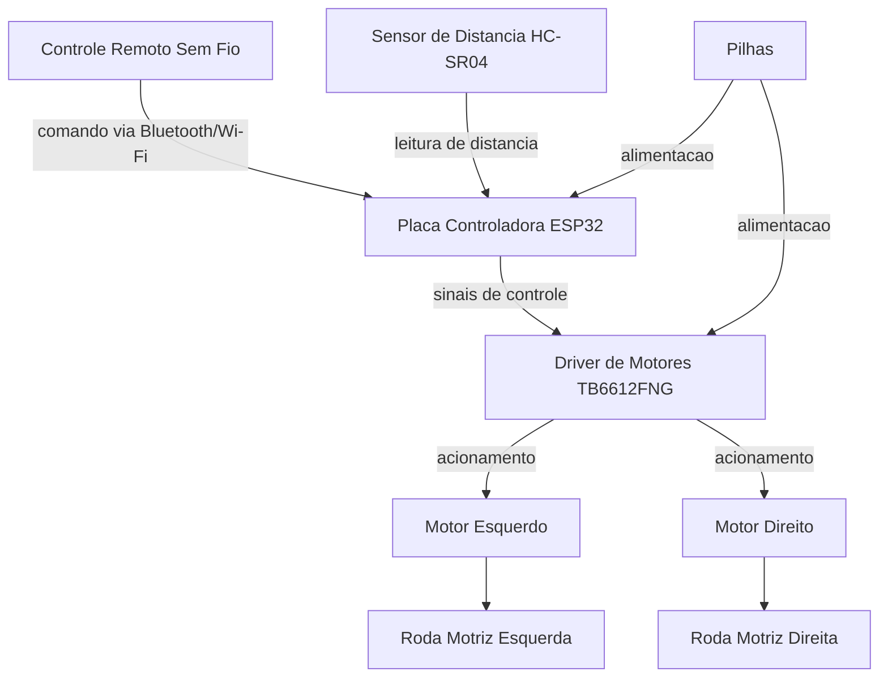

# Carrinho Robótico WALL-E


## Identificação Acadêmica

- **Turma:** 4ESPY
- **Avaliação:** CP1
- **Alunos:**
  - Julia Azevedo Lins — RM 98690
  - Luis Gustavo Barreto Garrido — RM 99210
  - Victor Hugo Aranda Forte — RM 99667
  - Felipe Cortez — RM 99750
  - Guilherme Akio — RM 98582

---

## 1. Título do Projeto

**Carrinho Robótico WALL-E** — Projeto de carrinho robótico físico e funcional, com carenagem estética inspirada no personagem WALL-E (filme *WALL-E*, Pixar).

---

## 2. Descrição do Projeto

O presente documento apresenta a documentação técnica referente à primeira etapa (PT1) do Checkpoint 1 (CP1) do projeto **Carrinho Robótico WALL-E**, desenvolvido no contexto da disciplina de Maker. O projeto consiste na concepção e, posteriormente, na construção de um carrinho robótico físico, composto por um chassi estrutural produzido por impressão 3D e por uma carenagem estética inspirada visualmente no personagem WALL-E.

Nesta etapa inicial, o foco é a definição da ficha de requisitos do projeto, contemplando dimensões planejadas, quantidade de motores, placa controladora, posicionamento dos componentes eletrônicos e o croqui esquemático do chassi. A construção física, a integração eletrônica completa e os testes funcionais serão tratados em etapas subsequentes do projeto.

---

## 3. Objetivo

Desenvolver um carrinho robótico funcional, inspirado visualmente no personagem WALL-E, capaz de:

- Movimentar-se por meio do acionamento dos motores, permitindo deslocamento para frente, para trás e curvas;
- Receber comandos de um controle remoto sem fio;
- Detectar obstáculos por meio de um sensor de distância;
- Apresentar uma carenagem externa que remeta às características visuais do personagem que inspira o projeto.

---

## 4. Escopo

O escopo desta entrega (PT1 - CP1) compreende exclusivamente a documentação técnica preliminar do projeto, incluindo:

- Ficha de requisitos (dimensões, quantidade de motores, placa controladora, posição dos componentes e croqui do chassi);
- Requisitos funcionais e físicos preliminares;
- Especificações técnicas já definidas até o momento;
- Indicação explícita dos parâmetros técnicos ainda pendentes de definição.

Não fazem parte do escopo desta etapa: a construção física do chassi e da carenagem, a montagem elétrica, a programação da placa controladora e os testes de campo, os quais serão conduzidos em etapas posteriores do projeto.

---

## 5. Ficha de Requisitos

| Item | Especificação | Status |
|---|---|---|
| Dimensões do chassi | 220 mm (comprimento) × 140 mm (largura) | Planejado, sujeito a ajuste |
| Altura aproximada do chassi | 35 mm | Planejado, sujeito a ajuste |
| Quantidade de motores | 2 motores DC com caixa de redução | Definido |
| Configuração de tração | 2WD (tração diferencial) | Definido |
| Placa controladora | ESP32 | Definido |
| Driver de motores | TB6612FNG | Definido |
| Sensor de distância | HC-SR04 | Definido |
| Rodas motrizes | 2 unidades | Definido |
| Roda de apoio | 1 roda caster | Definido |
| Pilhas | Não recarregáveis, posição central/inferior | Quantidade, modelo e tensão a definir |
| Controle remoto | Sem fio, via recursos do ESP32 (Bluetooth ou Wi-Fi) | Modelo a definir |
| Material do chassi | Impressão 3D | Definido |
| Material da carenagem | A definir dentre papel, papel cartão, papelão, MDF, acrílico, plástico ou peças impressas em 3D | Pendente de definição |

---

## 6. Requisitos Funcionais

| Código | Descrição |
|---|---|
| RF01 | O robô deve movimentar-se para frente. |
| RF02 | O robô deve movimentar-se para trás. |
| RF03 | O robô deve realizar curvas para a esquerda e para a direita utilizando controle diferencial dos motores. |
| RF04 | O robô deve receber comandos de um controle remoto sem fio. |
| RF05 | O robô deve detectar obstáculos utilizando um sensor de distância. |
| RF06 | O sistema deve ser capaz de interromper ou modificar o movimento quando um obstáculo for detectado a uma distância previamente definida. |

---

## 7. Requisitos Físicos

| Código | Descrição |
|---|---|
| RFIS01 | O chassi deve possuir aproximadamente 220 × 140 mm. |
| RFIS02 | O chassi deve ser produzido por impressão 3D. |
| RFIS03 | O chassi deve possuir espaço para acomodar os componentes eletrônicos. |
| RFIS04 | O chassi deve permitir a fixação dos dois motores. |
| RFIS05 | O chassi deve permitir a instalação das duas rodas motrizes e da roda caster. |
| RFIS06 | A carenagem deve ser fixada sobre o chassi sem impedir o acesso aos componentes para manutenção. |

---

## 8. Especificações Técnicas

### 8.1 Parâmetros definidos

- Placa controladora: ESP32, responsável pelo processamento dos comandos, controle dos motores, comunicação sem fio e leitura do sensor de distância;
- Driver de motores: TB6612FNG, responsável pelo acionamento dos dois motores DC;
- Sensor de distância: HC-SR04, para detecção de obstáculos;
- Configuração de tração: 2WD, com direção por controle diferencial entre os dois motores laterais;
- Comunicação: sem fio, utilizando os recursos nativos de conectividade do ESP32 (Bluetooth ou Wi-Fi).

### 8.2 Parâmetros pendentes de especificação

Os seguintes parâmetros técnicos ainda não foram definidos e **não devem ser considerados valores finais**:

- Quantidade, modelo e tensão das pilhas;
- Modelo exato dos motores DC;
- Dimensões das rodas motrizes e da roda caster;
- Velocidade de deslocamento;
- Autonomia do sistema;
- Peso total do robô;
- Corrente de operação;
- Torque dos motores;
- Modelo do controle remoto;
- Distância exata de detecção de obstáculos pelo sensor HC-SR04;
- Dimensões finais da carenagem.

Esses itens serão definidos em etapas posteriores do projeto, à medida que os testes elétricos e mecânicos forem realizados.

---

## 9. Lista de Componentes

| Componente | Quantidade | Função |
|---|---|---|
| Chassi impresso em 3D | 1 | Estrutura de sustentação dos componentes |
| Motor DC com caixa de redução | 2 | Tração das rodas motrizes |
| Roda motriz | 2 | Locomoção do robô |
| Roda caster | 1 | Apoio e estabilização |
| Placa controladora ESP32 | 1 | Processamento, controle e comunicação sem fio |
| Driver de motor TB6612FNG | 1 | Acionamento dos dois motores DC |
| Sensor de distância HC-SR04 | 1 | Detecção de obstáculos |
| Pilhas | Quantidade a definir | Alimentação elétrica do sistema (modelo e tensão a definir) |
| Controle remoto sem fio | 1 | Envio de comandos ao robô (modelo a definir) |
| Carenagem externa | 1 | Revestimento estético inspirado no WALL-E (material a definir) |

---

## 10. Arquitetura Geral do Sistema



A arquitetura descreve o fluxo lógico de informação e energia entre os componentes: o ESP32 atua como unidade central de processamento, recebendo comandos do controle remoto e dados do sensor de distância, e enviando sinais de controle ao driver TB6612FNG, responsável pelo acionamento independente de cada motor.

---

## 11. Distribuição dos Componentes no Chassi

A distribuição prevista dos componentes segue a organização esquemática abaixo (vista superior), podendo ser refinada durante a modelagem tridimensional do chassi:

```
                          FRENTE
                            ↓
        ┌──────────────────────────────────────┐
        │              HC-SR04                  │
        │           (sensor frontal)             │
        │                                        │
        │                ESP32                   │
        │        (placa controladora)            │
        │                                        │
        │                PILHAS                  │
        │      (região central/inferior)          │
        │                                        │
        │              TB6612FNG                 │
        │        (driver dos motores)            │
        │                                        │
        │     MOTOR                    MOTOR     │
        │   ESQUERDO                  DIREITO    │
        └──────────────────────────────────────┘
                           TRÁS
```

### 11.1 Justificativa do posicionamento

- **HC-SR04**: posicionado na parte frontal do chassi, permitindo a detecção de obstáculos no sentido de deslocamento principal;
- **ESP32**: posicionado em região central-superior, próxima ao sensor e equidistante dos dois motores, facilitando o roteamento de cabos;
- **Pilhas**: posicionadas na região central e baixa do chassi, contribuindo para o equilíbrio e a distribuição de peso;
- **TB6612FNG**: posicionado próximo à região dos motores, reduzindo o comprimento dos cabos de acionamento;
- **Motores**: posicionados nas laterais traseiras do chassi, um à esquerda e outro à direita, acionando diretamente as rodas motrizes.

---

## 12. Dimensões Previstas

| Dimensão | Valor planejado | Observação |
|---|---|---|
| Comprimento do chassi | 220 mm | Sujeito a ajuste durante a modelagem 3D |
| Largura do chassi | 140 mm | Sujeito a ajuste durante a modelagem 3D |
| Altura aproximada do chassi | 35 mm | Sujeito a ajuste durante a modelagem 3D |
| Dimensões da carenagem | A definir | Depende do material escolhido e da modelagem estética |
| Dimensões das rodas | A definir | Pendente de especificação |

**Observação importante:** as dimensões de 220 × 140 mm correspondem a valores **planejados** para o chassi, definidos com base no espaço estimado necessário para acomodar os componentes eletrônicos e mecânicos. Tais valores **não representam dimensões finais confirmadas**, podendo ser ajustados durante o processo de modelagem tridimensional e prototipagem.

---

## 13. Descrição do Funcionamento

O funcionamento do carrinho robótico é baseado na seguinte lógica operacional:

1. O usuário envia comandos de movimento por meio do controle remoto sem fio;
2. O ESP32 recebe os comandos via comunicação sem fio (Bluetooth ou Wi-Fi);
3. Simultaneamente, o ESP32 realiza a leitura contínua do sensor de distância HC-SR04, posicionado na parte frontal do robô;
4. Com base nos comandos recebidos e na leitura de distância, o ESP32 envia sinais de controle ao driver TB6612FNG;
5. O TB6612FNG aciona os dois motores DC de forma independente, permitindo deslocamento para frente, para trás e curvas por controle diferencial;
6. Caso um obstáculo seja detectado a uma distância previamente definida (parâmetro ainda pendente de especificação), o sistema deve interromper ou modificar o movimento em curso, conforme RF06. O robô não possui navegação autônoma: a movimentação é sempre iniciada por comando do controle remoto sem fio, cabendo ao ESP32 processar esse comando em conjunto com a leitura do HC-SR04; a reação específica diante do obstáculo (parada total, redução de velocidade ou bloqueio do comando em curso) será definida na etapa de implementação do firmware.

---

## 14. Descrição do Chassi

O chassi corresponde à estrutura inferior e funcional do robô, responsável por sustentar os componentes eletrônicos, os motores, as rodas e a carenagem. Suas principais características previstas são:

- Produção por impressão 3D, conforme RFIS02;
- Dimensões planejadas de 220 mm × 140 mm, com altura aproximada de 35 mm;
- Espaço interno reservado para acomodar a placa ESP32, o driver TB6612FNG, as pilhas e a fiação;
- Pontos de fixação para os dois motores DC, posicionados nas laterais traseiras;
- Suporte para as duas rodas motrizes e para a roda caster de apoio;
- Estrutura preparada para a instalação da carenagem em sua parte superior, sem comprometer o acesso aos componentes internos para eventual manutenção.

---

## 15. Descrição da Carenagem

A carenagem constitui o elemento primariamente **estético** do projeto, responsável por reproduzir visualmente as características do personagem WALL-E. O chassi, descrito na seção anterior, permanece como a estrutura funcional responsável por suportar os componentes eletromecânicos.

### 15.1 Materiais possíveis (a definir)

- Papel;
- Papel cartão;
- Papelão;
- MDF;
- Acrílico;
- Plástico;
- Peças impressas em 3D.

### 15.2 Características visuais a serem reproduzidas

- Corpo de formato retangular;
- Cabeça posicionada na parte superior do corpo;
- Dois olhos característicos do personagem;
- Braços laterais;
- Aparência geral de robô compacto;
- Elementos visuais que remetam às esteiras laterais do personagem.

O material definitivo, as dimensões finais e o método de fixação da carenagem sobre o chassi serão definidos em etapa posterior do projeto.

---

## 16. Croqui do Chassi

### 16.0 Imagens do Croqui


### 16.1 Vista Superior (Top View)

```
                                FRENTE
                                  ↓
        ┌────────────────────────────────────────────┐  ─┐
        │                  HC-SR04                     │   │
        │                                                │   │
        │                   ESP32                        │   │
        │                                                │   │
        │                  PILHAS                        │   │  140 mm
        │                                                │   │
        │                 TB6612FNG                      │   │
        │                                                │   │
        │      [MOTOR ESQ]              [MOTOR DIR]      │   │
        └────────────────────────────────────────────┘  ─┘
                                 TRÁS

        ├──────────────────── 220 mm ───────────────────┤
```

### 16.2 Vista Frontal (Front View)

```
              ┌──────────────────────────┐
              │         HC-SR04           │   ← sensor frontal
              ├──────────────────────────┤
              │                          │
              │      CORPO / CHASSI      │   ~35 mm (altura)
              │                          │
        (o)───┴──────────────────────────┴───(o)
      RODA MOTRIZ                        RODA MOTRIZ
       ESQUERDA                            DIREITA
```

### 16.3 Vista Traseira (Rear View)

```
              ┌──────────────────────────┐
              │                          │
              │      CORPO / CHASSI      │   ~35 mm (altura)
              │      (acesso interno)     │
        (o)───┴──────────────────────────┴───(o)
      RODA MOTRIZ                        RODA MOTRIZ
       ESQUERDA                            DIREITA
                        (△)
                   RODA CASTER
                (apoio traseiro)
```

### 16.4 Legenda

| Símbolo / Elemento | Descrição |
|---|---|
| HC-SR04 | Sensor de distância, posição frontal |
| ESP32 | Placa controladora, posição central-superior |
| TB6612FNG | Driver de motores, posição próxima aos motores |
| PILHAS | Fonte de alimentação, posição central-inferior |
| MOTOR ESQ / MOTOR DIR | Motores DC com caixa de redução, laterais traseiras |
| (o) RODA MOTRIZ | Rodas motrizes, laterais |
| (△) RODA CASTER | Roda de apoio, traseira |
| 220 mm × 140 mm | Dimensões planejadas do chassi (não finais) |

---

## 17. Considerações de Montagem

- A montagem eletrônica deve priorizar a organização da fiação entre o ESP32, o driver TB6612FNG e os motores, de modo a evitar interferências e facilitar a manutenção;
- As pilhas devem ser fixadas em posição central e baixa, contribuindo para a estabilidade e o equilíbrio do robô durante a locomoção;
- O sensor HC-SR04 deve ser instalado com visada livre na parte frontal, sem obstrução por elementos da carenagem;
- A carenagem deve ser projetada de forma a permitir sua remoção ou abertura, garantindo acesso aos componentes internos para ajustes e manutenção, conforme RFIS06;
- A fixação dos motores e das rodas deve considerar o alinhamento adequado para o correto funcionamento do controle diferencial de direção.

---

## 18. Considerações para a Entrega Final

Para a conclusão do projeto, as seguintes etapas ainda deverão ser realizadas:

- Definição final dos parâmetros técnicos atualmente pendentes (pilhas, motores, rodas, controle remoto, distância de detecção, entre outros);
- Modelagem tridimensional definitiva do chassi, com posterior impressão 3D;
- Confecção da carenagem, com definição do material a ser utilizado;
- Montagem elétrica completa dos componentes sobre o chassi;
- Desenvolvimento e testes do firmware do ESP32, contemplando o controle dos motores, a comunicação sem fio e a leitura do sensor de distância;
- Testes funcionais de locomoção, comunicação remota e detecção de obstáculos;
- Validação da integração entre o chassi funcional e a carenagem estética.

---

## 19. Possíveis Melhorias Futuras

- Implementação de controle de velocidade variável por meio de sinais PWM;
- Adição de sensores complementares, como sensores de linha ou de proximidade adicionais, para ampliar a percepção do ambiente;
- Utilização de aplicativo dedicado para controle via Wi-Fi, em substituição ou complemento ao controle remoto físico;
- Adição de sistema de iluminação (LEDs) para reforçar a caracterização visual do personagem WALL-E;
- Estudo de substituição das pilhas por bateria recarregável, caso a autonomia obtida se mostre insuficiente;
- Otimização estrutural do chassi visando redução de peso, mantendo a resistência mecânica necessária.

---

**Documento:** Documentação Técnica — PT1 - CP1
**Projeto:** Carrinho Robótico WALL-E
**Turma:** 4ESPY
**Autores:** Julia Azevedo Lins (RM 98690), Luis Gustavo Barreto Garrido (RM 99210), Victor Hugo Aranda Forte (RM 99667), Felipe Cortez (RM 99750), Guilherme Akio (RM 98582)
**Data:** 12/08/2026
