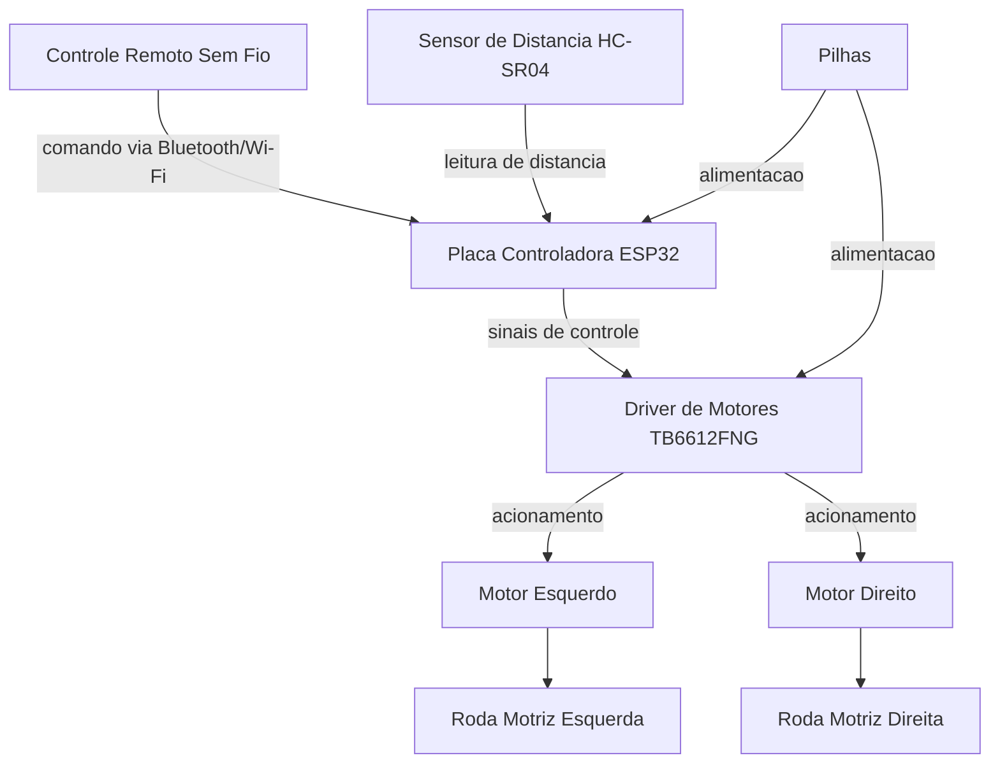
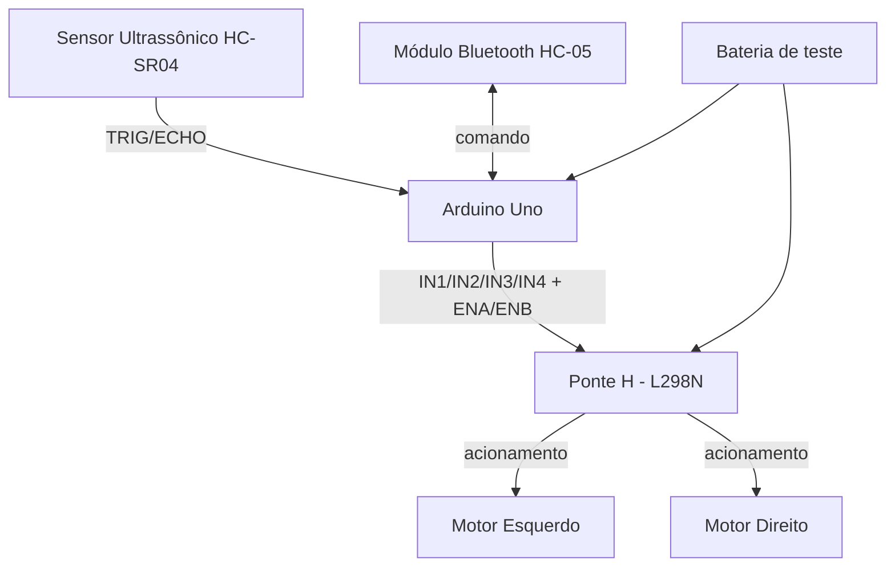

# Carrinho Robótico WALL-E


## Identificação Acadêmica

- **Turma:** 4ESPY
- **Avaliação:** CP1
- **Alunos:**
  - Julia Azevedo Lins — RM 98690
  - Luis Gustavo Barreto Garrido — RM 99210
  - Victor Hugo Aranda Forte — RM 99667
  - Felipe Cortez — RM 99750
  - Guilherme Akio — RM 98582

---

## 1. Título do Projeto

**Carrinho Robótico WALL-E** — Projeto de carrinho robótico físico e funcional, com carenagem estética inspirada no personagem WALL-E (filme *WALL-E*, Pixar).

---

## 2. Descrição do Projeto

O presente documento apresenta a documentação técnica referente à primeira etapa (PT1) do Checkpoint 1 (CP1) do projeto **Carrinho Robótico WALL-E**, desenvolvido no contexto da disciplina de Maker. O projeto consiste na concepção e, posteriormente, na construção de um carrinho robótico físico, composto por um chassi estrutural produzido por impressão 3D e por uma carenagem estética inspirada visualmente no personagem WALL-E.

Nesta etapa inicial, o foco é a definição da ficha de requisitos do projeto, contemplando dimensões planejadas, quantidade de motores, placa controladora, posicionamento dos componentes eletrônicos e o croqui esquemático do chassi. A construção física, a integração eletrônica completa e os testes funcionais serão tratados em etapas subsequentes do projeto.

---

## 3. Objetivo

Desenvolver um carrinho robótico funcional, inspirado visualmente no personagem WALL-E, capaz de:

- Movimentar-se por meio do acionamento dos motores, permitindo deslocamento para frente, para trás e curvas;
- Receber comandos de um controle remoto sem fio;
- Detectar obstáculos por meio de um sensor de distância;
- Apresentar uma carenagem externa que remeta às características visuais do personagem que inspira o projeto.

---

## 4. Escopo

O escopo desta entrega (PT1 - CP1) compreende exclusivamente a documentação técnica preliminar do projeto, incluindo:

- Ficha de requisitos (dimensões, quantidade de motores, placa controladora, posição dos componentes e croqui do chassi);
- Requisitos funcionais e físicos preliminares;
- Especificações técnicas já definidas até o momento;
- Indicação explícita dos parâmetros técnicos ainda pendentes de definição.

Não fazem parte do escopo desta etapa: a construção física do chassi e da carenagem, a montagem elétrica, a programação da placa controladora e os testes de campo, os quais serão conduzidos em etapas posteriores do projeto.

---

## 5. Ficha de Requisitos

| Item | Especificação | Status |
|---|---|---|
| Dimensões do chassi | 220 mm (comprimento) × 140 mm (largura) | Planejado, sujeito a ajuste |
| Altura aproximada do chassi | 35 mm | Planejado, sujeito a ajuste |
| Quantidade de motores | 2 motores DC com caixa de redução | Definido |
| Configuração de tração | 2WD (tração diferencial) | Definido |
| Placa controladora | ESP32 | Definido |
| Driver de motores | TB6612FNG | Definido |
| Sensor de distância | HC-SR04 | Definido |
| Rodas motrizes | 2 unidades | Definido |
| Roda de apoio | 1 roda caster | Definido |
| Pilhas | Não recarregáveis, posição central/inferior | Quantidade, modelo e tensão a definir |
| Controle remoto | Sem fio, via recursos do ESP32 (Bluetooth ou Wi-Fi) | Modelo a definir |
| Material do chassi | Impressão 3D | Definido |
| Material da carenagem | A definir dentre papel, papel cartão, papelão, MDF, acrílico, plástico ou peças impressas em 3D | Pendente de definição |

---

## 6. Requisitos Funcionais

| Código | Descrição |
|---|---|
| RF01 | O robô deve movimentar-se para frente. |
| RF02 | O robô deve movimentar-se para trás. |
| RF03 | O robô deve realizar curvas para a esquerda e para a direita utilizando controle diferencial dos motores. |
| RF04 | O robô deve receber comandos de um controle remoto sem fio. |
| RF05 | O robô deve detectar obstáculos utilizando um sensor de distância. |
| RF06 | O sistema deve ser capaz de interromper ou modificar o movimento quando um obstáculo for detectado a uma distância previamente definida. |

---

## 7. Requisitos Físicos

| Código | Descrição |
|---|---|
| RFIS01 | O chassi deve possuir aproximadamente 220 × 140 mm. |
| RFIS02 | O chassi deve ser produzido por impressão 3D. |
| RFIS03 | O chassi deve possuir espaço para acomodar os componentes eletrônicos. |
| RFIS04 | O chassi deve permitir a fixação dos dois motores. |
| RFIS05 | O chassi deve permitir a instalação das duas rodas motrizes e da roda caster. |
| RFIS06 | A carenagem deve ser fixada sobre o chassi sem impedir o acesso aos componentes para manutenção. |

---

## 8. Especificações Técnicas

### 8.1 Parâmetros definidos

- Placa controladora: ESP32, responsável pelo processamento dos comandos, controle dos motores, comunicação sem fio e leitura do sensor de distância;
- Driver de motores: TB6612FNG, responsável pelo acionamento dos dois motores DC;
- Sensor de distância: HC-SR04, para detecção de obstáculos;
- Configuração de tração: 2WD, com direção por controle diferencial entre os dois motores laterais;
- Comunicação: sem fio, utilizando os recursos nativos de conectividade do ESP32 (Bluetooth ou Wi-Fi).

### 8.2 Parâmetros pendentes de especificação

Os seguintes parâmetros técnicos ainda não foram definidos e **não devem ser considerados valores finais**:

- Quantidade, modelo e tensão das pilhas;
- Modelo exato dos motores DC;
- Dimensões das rodas motrizes e da roda caster;
- Velocidade de deslocamento;
- Autonomia do sistema;
- Peso total do robô;
- Corrente de operação;
- Torque dos motores;
- Modelo do controle remoto;
- Distância exata de detecção de obstáculos pelo sensor HC-SR04;
- Dimensões finais da carenagem.

Esses itens serão definidos em etapas posteriores do projeto, à medida que os testes elétricos e mecânicos forem realizados.

---

## 9. Lista de Componentes

| Componente | Quantidade | Função |
|---|---|---|
| Chassi impresso em 3D | 1 | Estrutura de sustentação dos componentes |
| Motor DC com caixa de redução | 2 | Tração das rodas motrizes |
| Roda motriz | 2 | Locomoção do robô |
| Roda caster | 1 | Apoio e estabilização |
| Placa controladora ESP32 | 1 | Processamento, controle e comunicação sem fio |
| Driver de motor TB6612FNG | 1 | Acionamento dos dois motores DC |
| Sensor de distância HC-SR04 | 1 | Detecção de obstáculos |
| Pilhas | Quantidade a definir | Alimentação elétrica do sistema (modelo e tensão a definir) |
| Controle remoto sem fio | 1 | Envio de comandos ao robô (modelo a definir) |
| Carenagem externa | 1 | Revestimento estético inspirado no WALL-E (material a definir) |

---

## 10. Arquitetura Geral do Sistema



A arquitetura descreve o fluxo lógico de informação e energia entre os componentes: o ESP32 atua como unidade central de processamento, recebendo comandos do controle remoto e dados do sensor de distância, e enviando sinais de controle ao driver TB6612FNG, responsável pelo acionamento independente de cada motor.

---

## 11. Distribuição dos Componentes no Chassi

A distribuição prevista dos componentes segue a organização esquemática abaixo (vista superior), podendo ser refinada durante a modelagem tridimensional do chassi:

```
                          FRENTE
                            ↓
        ┌──────────────────────────────────────┐
        │              HC-SR04                 │
        │           (sensor frontal)           │
        │                                      │
        │                ESP32                 │
        │        (placa controladora)          │
        │                                      │
        │                PILHAS                │
        │      (região central/inferior)       │
        │                                      │
        │              TB6612FNG               │
        │        (driver dos motores)          │
        │                                      │
        │     MOTOR                    MOTOR   │
        │   ESQUERDO                  DIREITO  │
        └──────────────────────────────────────┘
                           TRÁS
```

### 11.1 Justificativa do posicionamento

- **HC-SR04**: posicionado na parte frontal do chassi, permitindo a detecção de obstáculos no sentido de deslocamento principal;
- **ESP32**: posicionado em região central-superior, próxima ao sensor e equidistante dos dois motores, facilitando o roteamento de cabos;
- **Pilhas**: posicionadas na região central e baixa do chassi, contribuindo para o equilíbrio e a distribuição de peso;
- **TB6612FNG**: posicionado próximo à região dos motores, reduzindo o comprimento dos cabos de acionamento;
- **Motores**: posicionados nas laterais traseiras do chassi, um à esquerda e outro à direita, acionando diretamente as rodas motrizes.

---

## 12. Dimensões Previstas

Tabela de referência com as dimensões típicas dos componentes previstos (modelos ainda não definidos oficialmente), utilizada como base para a atividade em aula de acordo com valores da Internet.

| Componente | Comprimento | Largura | Altura | Forma de Fixação |
|---|---|---|---|---|
| Motor esquerdo | ~65 mm (corpo + eixo) | ~24 mm (diâmetro do corpo) | ~18 mm | Parafusado no chassi via suportes laterais (bracket em L), na lateral traseira esquerda |
| Motor direito | ~65 mm (corpo + eixo) | ~24 mm (diâmetro do corpo) | ~18 mm | Parafusado no chassi via suportes laterais (bracket em L), na lateral traseira direita |
| ESP32 (DevKit V1) | ~55 mm | ~28 mm | ~13 mm | Encaixe em soquetes/pinos ou fixação com parafusos M3 + espaçadores (standoffs), posição central-superior |
| Ponte H (TB6612FNG) | ~20 mm | ~22 mm | ~5 mm | Fixação com parafusos M2/M3 + espaçadores, próxima aos motores |

**Observação:** os valores acima são medidas de referência de mercado para os modelos mais comuns (motor DC TT com caixa de redução, ESP32 DevKit V1 e módulo TB6612FNG). Como o modelo exato de cada componente ainda está pendente de definição (seção 8.2), esses valores não devem ser considerados finais.

---

## 13. Descrição do Funcionamento

O funcionamento do carrinho robótico é baseado na seguinte lógica operacional:

1. O usuário envia comandos de movimento por meio do controle remoto sem fio;
2. O ESP32 recebe os comandos via comunicação sem fio (Bluetooth ou Wi-Fi);
3. Simultaneamente, o ESP32 realiza a leitura contínua do sensor de distância HC-SR04, posicionado na parte frontal do robô;
4. Com base nos comandos recebidos e na leitura de distância, o ESP32 envia sinais de controle ao driver TB6612FNG;
5. O TB6612FNG aciona os dois motores DC de forma independente, permitindo deslocamento para frente, para trás e curvas por controle diferencial;
6. Caso um obstáculo seja detectado a uma distância previamente definida (parâmetro ainda pendente de especificação), o sistema deve interromper ou modificar o movimento em curso, conforme RF06. O robô não possui navegação autônoma: a movimentação é sempre iniciada por comando do controle remoto sem fio, cabendo ao ESP32 processar esse comando em conjunto com a leitura do HC-SR04; a reação específica diante do obstáculo (parada total, redução de velocidade ou bloqueio do comando em curso) será definida na etapa de implementação do firmware.

---

## 14. Descrição do Chassi

O chassi corresponde à estrutura inferior e funcional do robô, responsável por sustentar os componentes eletrônicos, os motores, as rodas e a carenagem. Suas principais características previstas são:

- Produção por impressão 3D, conforme RFIS02;
- Dimensões planejadas de 220 mm × 140 mm, com altura aproximada de 35 mm;
- Espaço interno reservado para acomodar a placa ESP32, o driver TB6612FNG, as pilhas e a fiação;
- Pontos de fixação para os dois motores DC, posicionados nas laterais traseiras;
- Suporte para as duas rodas motrizes e para a roda caster de apoio;
- Estrutura preparada para a instalação da carenagem em sua parte superior, sem comprometer o acesso aos componentes internos para eventual manutenção.

---

## 15. Descrição da Carenagem

A carenagem constitui o elemento primariamente **estético** do projeto, responsável por reproduzir visualmente as características do personagem WALL-E. O chassi, descrito na seção anterior, permanece como a estrutura funcional responsável por suportar os componentes eletromecânicos.

### 15.1 Materiais possíveis (a definir)

- Papel;
- Papel cartão;
- Papelão;
- MDF;
- Acrílico;
- Plástico;
- Peças impressas em 3D.

### 15.2 Características visuais a serem reproduzidas

- Corpo de formato retangular;
- Cabeça posicionada na parte superior do corpo;
- Dois olhos característicos do personagem;
- Braços laterais;
- Aparência geral de robô compacto;
- Elementos visuais que remetam às esteiras laterais do personagem.

O material definitivo, as dimensões finais e o método de fixação da carenagem sobre o chassi serão definidos em etapa posterior do projeto.

---

## 16. Croqui do Chassi

### 16.0 Imagens do Croqui


### 16.1 Vista Superior (Top View)

```
                                FRENTE
                                  ↓
        ┌──────────────────────────────────────────────┐  ─┐
        │                  HC-SR04                     │   │
        │                                              │   │
        │                   ESP32                      │   │
        │                                              │   │
        │                  PILHAS                      │   │  140 mm
        │                                              │   │
        │                 TB6612FNG                    │   │
        │                                              │   │
        │      [MOTOR ESQ]              [MOTOR DIR]    │   │
        └──────────────────────────────────────────────┘  ─┘
                                 TRÁS

        ├──────────────────── 220 mm ───────────────────┤
```

### 16.2 Vista Frontal (Front View)

```
              ┌──────────────────────────┐
              │         HC-SR04          │   ← sensor frontal
              ├──────────────────────────┤
              │                          │
              │      CORPO / CHASSI      │   ~35 mm (altura)
              │                          │
        (o)───┴──────────────────────────┴───(o)
      RODA MOTRIZ                        RODA MOTRIZ
       ESQUERDA                            DIREITA
```

### 16.3 Vista Traseira (Rear View)

```
              ┌──────────────────────────┐
              │                          │
              │      CORPO / CHASSI      │   ~35 mm (altura)
              │      (acesso interno)    │
        (o)───┴──────────────────────────┴───(o)
      RODA MOTRIZ                        RODA MOTRIZ
       ESQUERDA                            DIREITA
                        (△)
                   RODA CASTER
                (apoio traseiro)
```

### 16.4 Legenda

| Símbolo / Elemento | Descrição |
|---|---|
| HC-SR04 | Sensor de distância, posição frontal |
| ESP32 | Placa controladora, posição central-superior |
| TB6612FNG | Driver de motores, posição próxima aos motores |
| PILHAS | Fonte de alimentação, posição central-inferior |
| MOTOR ESQ / MOTOR DIR | Motores DC com caixa de redução, laterais traseiras |
| (o) RODA MOTRIZ | Rodas motrizes, laterais |
| (△) RODA CASTER | Roda de apoio, traseira |
| 220 mm × 140 mm | Dimensões planejadas do chassi (não finais) |

---

## 17. Considerações de Montagem

- A montagem eletrônica deve priorizar a organização da fiação entre o ESP32, o driver TB6612FNG e os motores, de modo a evitar interferências e facilitar a manutenção;
- As pilhas devem ser fixadas em posição central e baixa, contribuindo para a estabilidade e o equilíbrio do robô durante a locomoção;
- O sensor HC-SR04 deve ser instalado com visada livre na parte frontal, sem obstrução por elementos da carenagem;
- A carenagem deve ser projetada de forma a permitir sua remoção ou abertura, garantindo acesso aos componentes internos para ajustes e manutenção, conforme RFIS06;
- A fixação dos motores e das rodas deve considerar o alinhamento adequado para o correto funcionamento do controle diferencial de direção.

---

## 18. Considerações para a Entrega Final

Para a conclusão do projeto, as seguintes etapas ainda deverão ser realizadas:

- Definição final dos parâmetros técnicos atualmente pendentes (pilhas, motores, rodas, controle remoto, distância de detecção, entre outros);
- Modelagem tridimensional definitiva do chassi, com posterior impressão 3D;
- Confecção da carenagem, com definição do material a ser utilizado;
- Montagem elétrica completa dos componentes sobre o chassi;
- Desenvolvimento e testes do firmware do ESP32, contemplando o controle dos motores, a comunicação sem fio e a leitura do sensor de distância;
- Testes funcionais de locomoção, comunicação remota e detecção de obstáculos;
- Validação da integração entre o chassi funcional e a carenagem estética.

---

## 19. Possíveis Melhorias Futuras

- Implementação de controle de velocidade variável por meio de sinais PWM;
- Adição de sensores complementares, como sensores de linha ou de proximidade adicionais, para ampliar a percepção do ambiente;
- Utilização de aplicativo dedicado para controle via Wi-Fi, em substituição ou complemento ao controle remoto físico;
- Adição de sistema de iluminação (LEDs) para reforçar a caracterização visual do personagem WALL-E;
- Estudo de substituição das pilhas por bateria recarregável, caso a autonomia obtida se mostre insuficiente;
- Otimização estrutural do chassi visando redução de peso, mantendo a resistência mecânica necessária.

---

## 20. Aula 15 — Arquitetura Eletrônica: Diagrama de Blocos e Alimentação

Nesta etapa o grupo realizou a **montagem física de bancada** dos componentes eletrônicos, com o objetivo de validar o diagrama de blocos, o diagrama de alimentação e a pinagem antes da integração definitiva no chassi.

### 20.1 Diagrama de Blocos (montagem de bancada)



### 20.2 Diagrama de Alimentação (montagem de bancada)

```
BATERIA
   │
   ▼
PONTE H (L298N) ──► MOTORES
   │
   ▼
ARDUINO ──► SENSOR / BLUETOOTH
```

### 20.3 Registro fotográfico da montagem


.png>)


### 20.4 Pinagem validada na bancada

Durante a montagem, o grupo já testou e validou quais pinos serão utilizados para cada componente:

| Componente | Sinal | Pino (Arduino Uno — teste de bancada) |
|---|---|---|
| Ponte H (L298N) | IN1 (direção motor esquerdo) | D4 |
| Ponte H (L298N) | IN2 (direção motor esquerdo) | D7 |
| Ponte H (L298N) | IN3 (direção motor direito) | D8 |
| Ponte H (L298N) | IN4 (direção motor direito) | D12 |
| Ponte H (L298N) | ENA (PWM / velocidade motor esquerdo) | D5 |
| Ponte H (L298N) | ENB (PWM / velocidade motor direito) | D6 |
| Sensor HC-SR04 | TRIG | D2 |
| Sensor HC-SR04 | ECHO | D3 |

### 20.5 Observações importantes sobre a montagem de teste vs. versão final

> ⚠️ A montagem de bancada desta etapa foi feita com os componentes disponíveis no momento, **apenas para validar lógica, ligações e pinagem**. Os itens abaixo **não são os componentes definitivos** do projeto:

- **Placa controladora:** a montagem de bancada usou um **Arduino Uno**, mas a versão final do robô utilizará **ESP32** (conforme já definido na Ficha de Requisitos, seção 5). A pinagem acima será remapeada para os GPIOs do ESP32 na integração final.
- **Alimentação:** a montagem de bancada usou uma **bateria** (par de células recarregáveis) apenas por estarem disponíveis para o teste rápido. Na versão final do projeto será utilizada **pilha** (não recarregável), conforme já definido na Ficha de Requisitos (seção 5) e no Diagrama de Alimentação.

---

## 21. Aula 16 — Programação e Testes Iniciais

Com a pinagem validada na Aula 15, o grupo avançou para os testes de programação, seguindo a lógica de **programação modular** e **teste incremental** apresentada em aula: motor a motor, depois movimentos, depois sensor, depois comunicação sem fio.

### 21.1 Teste — Controle sem fio via Bluetooth

O grupo testou o controle remoto do carrinho via **módulo Bluetooth (HC-05)**, comandado por um aplicativo de controle (gamepad) no celular. O teste **funcionou**: o carrinho respondeu corretamente aos comandos enviados pelo app (frente, trás, esquerda, direita).


🎥 Vídeo do teste: [Controle Bluetooth.mp4](<vídeo/Controle Bluetooth.mp4>) *(o link abre o player de vídeo do próprio GitHub — veja a observação sobre reprodução do vídeo na seção 21.3)*

**Código utilizado no teste** (arquivo [`Motor + Bluetooth.ino`](<Motor + Bluetooth.ino>), também disponível no repositório, testado em Arduino Uno + L298N + HC-SR04 + HC-05):

```cpp
/*
  Carrinho WALL-E — teste de bancada: Arduino Uno + L298N + HC-SR04 + HC-05 (Bluetooth clássico)

  Controle pelo app "Arduino Bluetooth Controller" (Giumig / com.giumig.apps.bluetoothserialmonitor)
  ou qualquer outro app que envie os caracteres F / B / L / R / S por Bluetooth clássico (SPP).

  IMPORTANTE: o app "BLE Controller" (que vocês baixaram antes) NÃO funciona com o HC-05 —
  o HC-05 comum usa Bluetooth clássico (SPP), não BLE. Por isso o app certo aqui é o
  "Arduino Bluetooth Controller" (funciona com HC-05/HC-06).

  Comandos recebidos via Bluetooth:
    F = frente   B = trás   L = esquerda   R = direita   S = parar (padrão quando solta o botão)

  A parada por obstáculo (HC-SR04) continua ativa: mesmo que o comando seja "F" (frente),
  se detectar algo perto, o carrinho para sozinho.
*/

#include <SoftwareSerial.h>

// HC-05: usamos SoftwareSerial em vez dos pinos 0/1, assim não precisa desconectar
// nada na hora de gravar o código pelo USB.
SoftwareSerial BT(11, 12); // pino 11 = RX do Arduino (liga no TXD do HC-05)
                            // pino 12 = TX do Arduino (liga no RXD do HC-05, via divisor resistivo)
                            // NOTA: pino 12 é normalmente IN4, mas desativado pra este teste

// ---------- Pinos do L298N (motores) ----------
const int IN1 = 4;
const int IN2 = 7;
const int IN3 = 8;
// const int IN4 = 12;  // DESATIVADO NESTE TESTE: pino 12 está sendo usado pelo HC-05 (TX)
const int ENA = 5; // PWM
const int ENB = 6; // PWM

// ---------- Pinos do HC-SR04 ----------
const int TRIG = 2;
const int ECHO = 3;

// ---------- Parâmetros ----------
const int VELOCIDADE = 200;
const float DISTANCIA_MINIMA_CM = 15.0;

char comando = 'S';

void setup() {
  pinMode(IN1, OUTPUT);
  pinMode(IN2, OUTPUT);
  pinMode(IN3, OUTPUT);
  // pinMode(IN4, OUTPUT);  // desativado neste teste (pino 12 = HC-05 TX)
  pinMode(ENA, OUTPUT);
  pinMode(ENB, OUTPUT);
  pinMode(TRIG, OUTPUT);
  pinMode(ECHO, INPUT);

  Serial.begin(9600);  // Serial Monitor (USB) - continua livre, não conflita com o BT
  BT.begin(9600);       // baud padrão da maioria dos módulos HC-05 (confirme com AT+UART?)

  parar();
  Serial.println("Pronto. Aguardando comandos via Bluetooth (F/B/L/R/S)...");
}

void loop() {
  if (BT.available()) {
    comando = BT.read();
    Serial.print("Comando recebido: ");
    Serial.println(comando);
  }

  float distancia = lerDistanciaCM();
  bool obstaculo = (distancia > 0 && distancia < DISTANCIA_MINIMA_CM);

  switch (comando) {
    case 'F':
      if (obstaculo) {
        parar();
        Serial.println("Obstaculo detectado - avanco bloqueado");
      } else {
        frente();
      }
      break;
    case 'B':
      tras();
      break;
    case 'L':
      esquerda();
      break;
    case 'R':
      direita();
      break;
    case 'S':
    default:
      parar();
      break;
  }

  delay(50);
}

// =====================================================================
// Funções de movimento
// =====================================================================

void frente() {
  digitalWrite(IN1, HIGH);
  digitalWrite(IN2, LOW);
  digitalWrite(IN3, HIGH);
  // digitalWrite(IN4, LOW);  // desativado neste teste (pino 12 = HC-05 TX)
  analogWrite(ENA, VELOCIDADE);
  analogWrite(ENB, VELOCIDADE);
}

void tras() {
  digitalWrite(IN1, LOW);
  digitalWrite(IN2, HIGH);
  digitalWrite(IN3, LOW);
  // digitalWrite(IN4, HIGH);  // desativado neste teste (pino 12 = HC-05 TX)
  analogWrite(ENA, VELOCIDADE);
  analogWrite(ENB, VELOCIDADE);
}

void esquerda() {
  digitalWrite(IN1, LOW);
  digitalWrite(IN2, HIGH);
  digitalWrite(IN3, HIGH);
  // digitalWrite(IN4, LOW);  // desativado neste teste (pino 12 = HC-05 TX)
  analogWrite(ENA, VELOCIDADE);
  analogWrite(ENB, VELOCIDADE);
}

void direita() {
  digitalWrite(IN1, HIGH);
  digitalWrite(IN2, LOW);
  digitalWrite(IN3, LOW);
  // digitalWrite(IN4, HIGH);  // desativado neste teste (pino 12 = HC-05 TX)
  analogWrite(ENA, VELOCIDADE);
  analogWrite(ENB, VELOCIDADE);
}

void parar() {
  digitalWrite(IN1, LOW);
  digitalWrite(IN2, LOW);
  digitalWrite(IN3, LOW);
  // digitalWrite(IN4, LOW);  // desativado neste teste (pino 12 = HC-05 TX)
  analogWrite(ENA, 0);
  analogWrite(ENB, 0);
}

// =====================================================================
// Sensor ultrassônico HC-SR04
// =====================================================================

float lerDistanciaCM() {
  digitalWrite(TRIG, LOW);
  delayMicroseconds(2);
  digitalWrite(TRIG, HIGH);
  delayMicroseconds(10);
  digitalWrite(TRIG, LOW);

  long duracao = pulseIn(ECHO, HIGH, 30000);
  if (duracao == 0) {
    return -1;
  }
  return duracao * 0.0343 / 2.0;
}
```

### 21.2 Teste — Motor + Sensor de Aproximação

O grupo também testou a integração entre os motores e o **sensor ultrassônico HC-SR04**. Nesse teste, o carrinho anda para frente continuamente e **os motores param automaticamente quando o sensor detecta um objeto próximo**, validando o comportamento esperado pelos requisitos RF05 (detecção de obstáculos) e RF06 (interrupção do movimento ao detectar obstáculo).

🎥 Vídeo do teste: [Motor + Sensor de Aproximação.mp4](<vídeo/Motor + Sensor de Aproximação.mp4>) *(o link abre o player de vídeo do próprio GitHub — veja a observação sobre reprodução do vídeo na seção 21.3)*

No vídeo é possível observar os motores parando assim que o carrinho se aproxima do objeto.

**Código utilizado no teste** (arquivo [`Motor + Sensor de Aproximacao.ino`](<Motor + Sensor de Aproximacao.ino>), também disponível no repositório, testado em Arduino Uno + L298N + pilhas AA):

```cpp
/*
  Carrinho Robótico WALL-E — teste de motores + sensor (Arduino Uno + L298N)

  Baseado na montagem: Arduino Uno + módulo L298N + 2 motores DC + 4x pilhas AA
  (mesma montagem da imagem de referência), com o sensor HC-SR04 adicionado.

  Comportamento: o carrinho anda para frente continuamente e PARA automaticamente
  quando o HC-SR04 detecta um objeto mais perto que DISTANCIA_MINIMA_CM.

  Este código NÃO tem controle remoto (Bluetooth/app) — é só o teste de
  motores + sensor. Dá pra somar o controle remoto depois, em cima disso.
*/

// ---------- Pinos do L298N (motores) ----------
const int IN1 = 4;   // direção motor esquerdo
const int IN2 = 7;   // direção motor esquerdo
const int IN3 = 8;   // direção motor direito
const int IN4 = 12;  // direção motor direito
const int ENA = 5;   // velocidade motor esquerdo (PWM)
const int ENB = 6;   // velocidade motor direito (PWM)

// ---------- Pinos do sensor HC-SR04 ----------
const int TRIG = 2;
const int ECHO = 3;
// No Arduino Uno NÃO precisa de divisor resistivo no ECHO — a lógica do Uno já é 5V,
// igual ao HC-SR04 (isso só é necessário no ESP32, que trabalha em 3.3V).

// ---------- Parâmetros ajustáveis ----------
const int VELOCIDADE = 200;              // 0-255
const float DISTANCIA_MINIMA_CM = 15.0;  // ajustar depois de testar na prática

void setup() {
  pinMode(IN1, OUTPUT);
  pinMode(IN2, OUTPUT);
  pinMode(IN3, OUTPUT);
  pinMode(IN4, OUTPUT);
  pinMode(ENA, OUTPUT);
  pinMode(ENB, OUTPUT);
  pinMode(TRIG, OUTPUT);
  pinMode(ECHO, INPUT);

  Serial.begin(9600);
  parar();
  Serial.println("Pronto. Andando para frente ate encontrar um obstaculo.");
}

void loop() {
  float distancia = lerDistanciaCM();

  Serial.print("Distancia: ");
  Serial.print(distancia);
  Serial.println(" cm");

  if (distancia > 0 && distancia < DISTANCIA_MINIMA_CM) {
    parar();
    Serial.println("Objeto detectado - motores parados");
  } else {
    frente();
  }

  delay(100); // pequena pausa entre leituras
}

// =====================================================================
// Funções de movimento
// =====================================================================

void frente() {
  digitalWrite(IN1, HIGH);
  digitalWrite(IN2, LOW);
  digitalWrite(IN3, HIGH);
  digitalWrite(IN4, LOW);
  analogWrite(ENA, VELOCIDADE);
  analogWrite(ENB, VELOCIDADE);
}

void tras() {
  digitalWrite(IN1, LOW);
  digitalWrite(IN2, HIGH);
  digitalWrite(IN3, LOW);
  digitalWrite(IN4, HIGH);
  analogWrite(ENA, VELOCIDADE);
  analogWrite(ENB, VELOCIDADE);
}

void esquerda() {
  // giro no proprio eixo
  digitalWrite(IN1, LOW);
  digitalWrite(IN2, HIGH);
  digitalWrite(IN3, HIGH);
  digitalWrite(IN4, LOW);
  analogWrite(ENA, VELOCIDADE);
  analogWrite(ENB, VELOCIDADE);
}

void direita() {
  digitalWrite(IN1, HIGH);
  digitalWrite(IN2, LOW);
  digitalWrite(IN3, LOW);
  digitalWrite(IN4, HIGH);
  analogWrite(ENA, VELOCIDADE);
  analogWrite(ENB, VELOCIDADE);
}

void parar() {
  digitalWrite(IN1, LOW);
  digitalWrite(IN2, LOW);
  digitalWrite(IN3, LOW);
  digitalWrite(IN4, LOW);
  analogWrite(ENA, 0);
  analogWrite(ENB, 0);
}

// =====================================================================
// Sensor ultrassônico HC-SR04
// =====================================================================

float lerDistanciaCM() {
  digitalWrite(TRIG, LOW);
  delayMicroseconds(2);
  digitalWrite(TRIG, HIGH);
  delayMicroseconds(10);
  digitalWrite(TRIG, LOW);

  long duracao = pulseIn(ECHO, HIGH, 30000); // timeout 30ms

  if (duracao == 0) {
    return -1; // sem leitura valida
  }

  return duracao * 0.0343 / 2.0;
}
```

### 21.3 Como assistir aos vídeos e onde está o código

- **Vídeo:** o GitHub não reproduz vídeo diretamente dentro da página do `Documentacao.md` (markdown não dá suporte a player embutido/autoplay por segurança). Ao clicar em um dos links de vídeo acima, o GitHub abre a página do arquivo (`.mp4`) dentro do repositório, e nessa página o **próprio GitHub exibe um player nativo com botão de play** — não é necessário baixar o arquivo, só clicar em play na página que abrir.
- **Código:** os arquivos `.ino` usados nos testes (`Motor + Bluetooth.ino` e `Motor + Sensor de Aproximacao.ino`) estão versionados na raiz deste repositório, além de estarem reproduzidos nesta documentação (seções 21.1 e 21.2).

### 21.4 Observação sobre a placa utilizada nos testes

Assim como na Aula 15, os testes de programação desta etapa (Bluetooth e sensor) foram realizados em **Arduino Uno**, por ser a placa disponível para os testes rápidos de bancada. A lógica validada (módulos de movimento, leitura do sensor, parada por proximidade e controle remoto) será portada para o **ESP32**, placa controladora definitiva do projeto.

---

## 22. Planejamento e Gestão do Projeto

Esta documentação técnica cobre a concepção física e funcional do robô. O planejamento e a gestão da execução (cronograma, priorização, tarefas e custos) ficam na pasta [`Organização/`](<Organização/README.md>), com os seguintes arquivos:

| Arquivo | Caminho | O que é |
|---|---|---|
| MVP | [`Organização/MVP.html`](<Organização/MVP.html>) | Definição do produto minimamente funcional, critérios de aceite e cronograma de marcos até a entrega do CP1 |
| MoSCoW | [`Organização/MoSCoW.html`](<Organização/MoSCoW.html>) | Priorização das funcionalidades em Must/Should/Could/Won't have |
| Backlog | [`Organização/Backlog.html`](<Organização/Backlog.html>) | Lista das 22 tarefas do projeto, com responsável, apoio, prioridade, pontos, prazo e critério de aceite |
| Dependências | [`Organização/Dependências.html`](<Organização/Dependências.html>) | Precedências entre tarefas, caminho crítico e riscos/dependências externas |
| Kanban | [`Organização/Kanban.html`](<Organização/Kanban.html>) | Quadro com a situação atual das tarefas (A fazer / Em andamento / Em validação / Concluído) |
| Planilha de custos | [`Organização/Planilha-de-custos.xlsx`](<Organização/Planilha-de-custos.xlsx>) | Planilha original (Excel) com materiais, links de compra, preços, quantidades e total estimado |
| Resumo da planilha de custos | [`Organização/Resumo-Planilha-de-custos.html`](<Organização/Resumo-Planilha-de-custos.html>) | Versão visual (HTML) da planilha de custos, agrupada por categoria, com status de compra de cada item |

---

**Documento:** Documentação Técnica — PT1 - CP1
**Projeto:** Carrinho Robótico WALL-E
**Turma:** 4ESPY
**Última alteração em:** 19/08/2026
