# Modelagem 3D e Fabricação — Carrinho Robótico WALL-E

Esta pasta reúne o projeto mecânico do robô: o arquivo de projeto do slicer, os STL das peças desenvolvidas pela equipe e os renders das chapas de impressão.

## Conteúdo

| Arquivo / pasta | O que é |
|---|---|
| `Wall-E_Articulated(3).3mf` | Projeto completo no Bambu Studio — 16 chapas, todas as peças posicionadas, cortes e perfis de impressão |
| `stl/` | STL das peças **desenvolvidas/adaptadas pela equipe** |
| `renders/` | Renders das 16 chapas de impressão, extraídos do próprio projeto |

## Modelo base

O corpo, a cabeça, os braços e o conjunto de esteiras partem do modelo **"WALL-E Robot - Articulated"**, do designer **RoboDIYer** (MakerWorld, `DesignModelId US945b2b739cf63c`, Standard Digital File License). O modelo original é uma figura articulada decorativa, com esteiras funcionais em TPU, montagem por encaixe e sem qualquer previsão de eletrônica embarcada.

A equipe partiu dele e o converteu em um robô motorizado. As adaptações estão descritas abaixo.

## Adaptações feitas pela equipe

O modelo original é uma figura de brinquedo: as esteiras giram livres, empurradas com a mão. Transformá-lo em um carrinho motorizado exigiu quatro intervenções no projeto mecânico.

| Peça | Dimensões | Por que existe |
|---|---|---|
| `corpo-wall-e-furado.stl` | 204,4 × 126,0 × 77,7 mm | Corpo do WALL-E perfurado por operação booleana. Os furos abrem passagem para os eixos dos motores DC, para a fiação e para o sensor HC-SR04 na face frontal. O modelo original é maciço nessas regiões. |
| `extensor-de-eixo.stl` (×2) | 7,6 × 24,0 × 6,4 mm | **Peça-chave do projeto.** Acopla o eixo do motor DC TT à roda dentada que traciona a esteira. O motor fica dentro do corpo e a roda dentada, fora do track frame — o extensor vence essa distância e transmite o torque. Sem ele, não há como motorizar o modelo original. |
| `roda-boba-caster.stl` | 86,0 × 36,0 × 15,0 mm | Roda boba (caster) traseira. Como a tração passou a ser motorizada e concentrada nas duas esteiras, o conjunto precisou de um terceiro ponto de apoio para não cabecear. Atende ao requisito RFIS05. |
| `travessa-interna.stl` | 98,0 × 25,0 × 14,0 mm | Travessa interna que sustenta e alinha os motores dentro do corpo, mantendo os dois eixos coaxiais. |

### Corte do corpo para impressão

O corpo montado tem 204 × 126 × 78 mm e não cabia em uma única chapa com orientação adequada. Ele foi **seccionado dentro do Bambu Studio** em três partes (`Body_B_B`, `Body_B_B_A`, `Body_B_B_B_B`), reunidas por **7 pinos de encaixe** (`Conector-1` a `Conector-7`, duplicados nas duas interfaces de corte).

O corte trouxe um ganho que não estava previsto: o corpo passou a **abrir**, dando acesso à eletrônica interna (ESP32, ponte H e pilhas) sem desmontar esteiras, braços ou cabeça. Isso atende diretamente ao requisito RFIS06 — a carenagem não pode impedir o acesso aos componentes para manutenção.

Uma primitiva cilíndrica (`Genérico-Cilindro`) foi usada como ferramenta de subtração booleana para abrir as passagens de eixo.

## Chassi e carenagem são a mesma peça

Na concepção inicial (seção 14 da [documentação técnica](../Documentacao.md)) o projeto previa duas peças distintas: um chassi plano de 220 × 140 × 35 mm e uma carenagem estética montada por cima.

Na versão final essa separação deixou de existir. **O corpo impresso do WALL-E é, ao mesmo tempo, a estrutura que sustenta os componentes e a carenagem estética.** Os motores, o ESP32, a ponte H e as pilhas ficam alojados dentro dele; as esteiras se fixam nos track frames parafusados às laterais.

A mudança eliminou uma peça, reduziu o peso e melhorou o resultado visual — o robô é o personagem, e não um chassi com uma casca por cima.

## Parâmetros de impressão

| Parâmetro | Valor |
|---|---|
| Impressora | Bambu Lab A1, bico 0,4 mm |
| Perfil | 0.20 mm Standard @BBL A1 |
| Altura de camada | 0,2 mm |
| Paredes | 2 |
| Preenchimento | 15% |
| Suporte | Árvore (automático) |
| Brim | Automático |
| Chapas | 16 |
| Filamentos | 5 × PLA (amarelo, preto, prata, vermelho, cinza) + **1 × TPU 95A** |

> ⚠️ **As esteiras (`Track x2`) precisam ser impressas em TPU 95A.** Em PLA elas quebram e não acompanham a roda dentada. É o único item do projeto que exige filamento flexível.

Peças que devem ser impressas juntas, como conjunto *print-in-place* (não separar nas chapas): corpo + tampa frontal; braço + junta de ombro; antebraço + garra.

## Versões do modelo

| Versão | Registro |
|---|---|
| v1 | Modelo base importado do MakerWorld, sem alterações |
| v2 | `Wall-E_Articulated(2).3mf` — corte do corpo e primeiros furos |
| v3 | `Wall-E_Articulated(3).3mf` — **versão atual**: furação final, extensor de eixo, roda boba, travessa interna e reorganização das 16 chapas |

O encadeamento das versões está registrado dentro do próprio projeto: cada peça do arquivo atual carrega o metadado `source_file` apontando para `Wall-E_Articulated(2).3mf`.

## Renders das chapas

Os 16 renders em `renders/` mostram o arranjo de cada chapa de impressão exatamente como foi enviado à impressora.

| | | | |
|---|---|---|---|
| 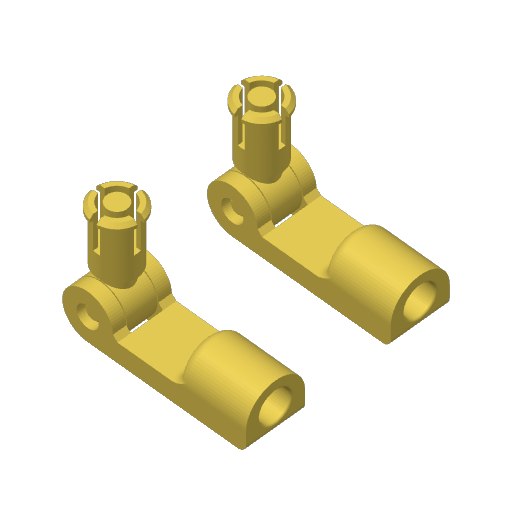 | 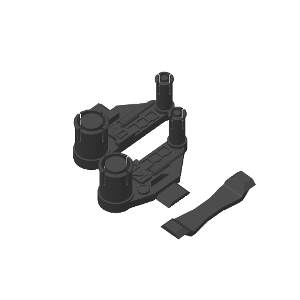 | 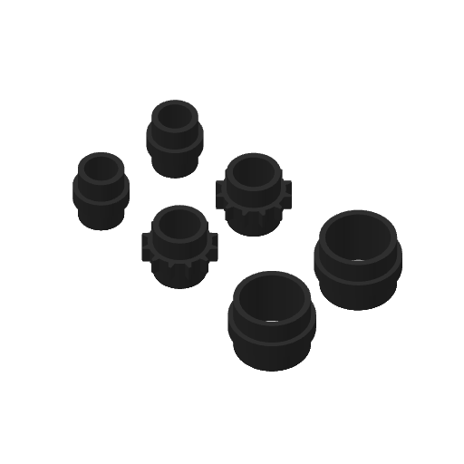 | 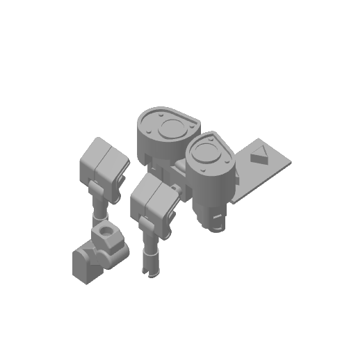 |
| 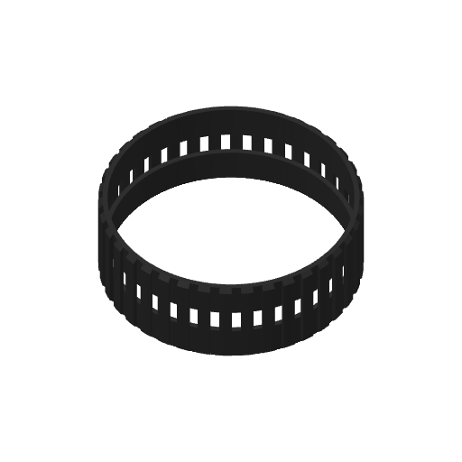 | 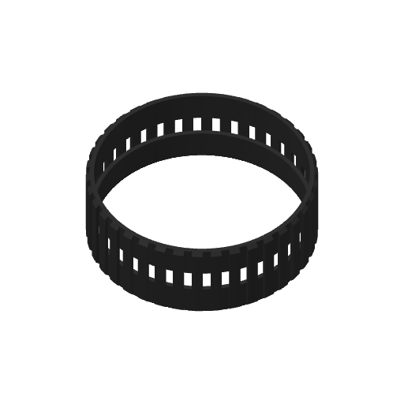 | 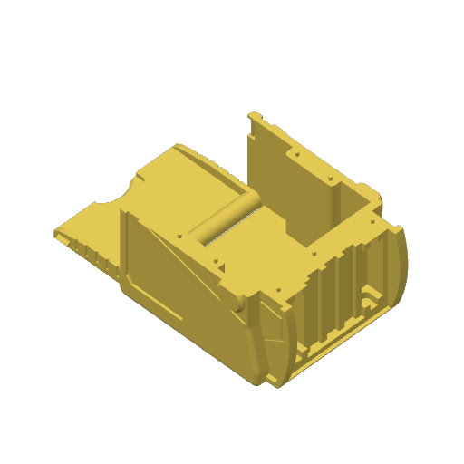 | 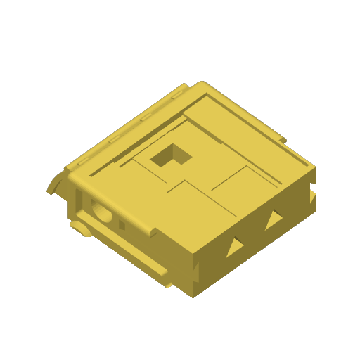 |
| 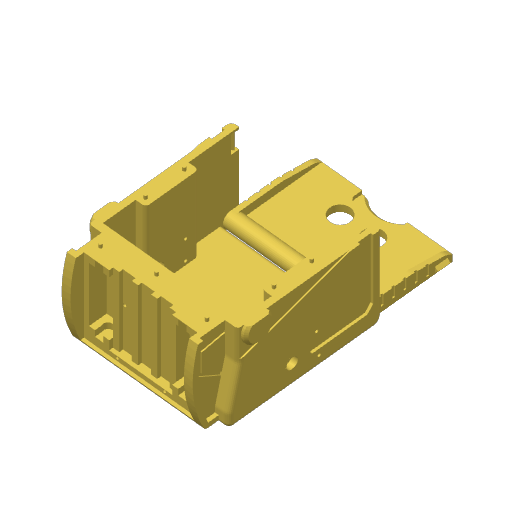 | 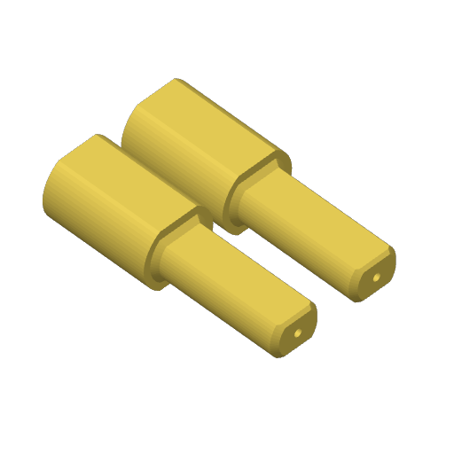 | 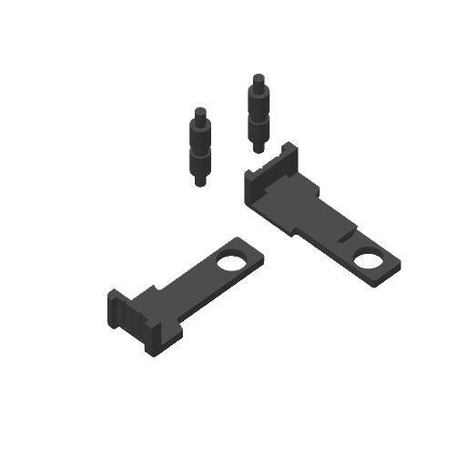 | 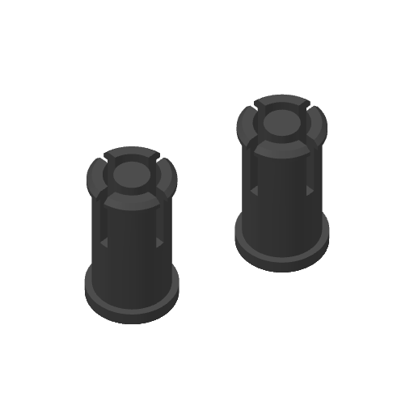 |
| 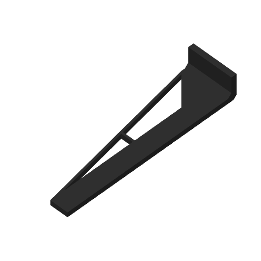 | 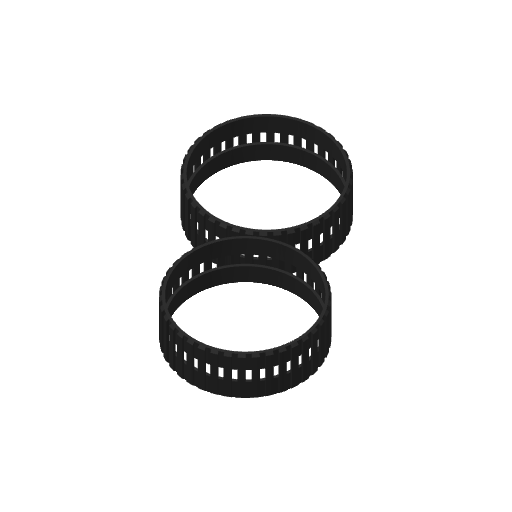 | 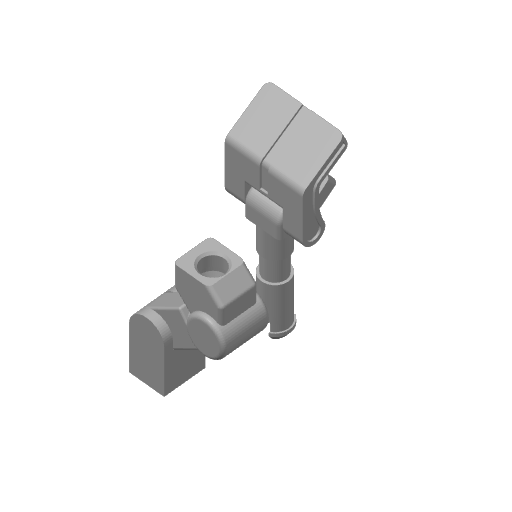 | 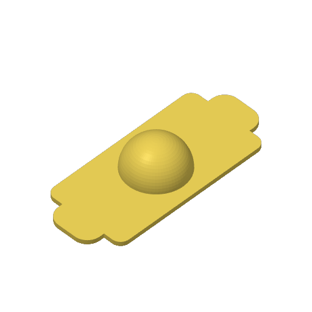 |

## Como reproduzir

1. Abra `Wall-E_Articulated(3).3mf` no Bambu Studio (2.07 ou superior).
2. Confirme o perfil `0.20mm Standard @BBL A1` e a impressora Bambu Lab A1 com bico 0,4 mm.
3. Carregue TPU 95A no slot correspondente antes de fatiar a chapa das esteiras.
4. Fatie e imprima chapa por chapa.
5. Para reimprimir apenas as peças da equipe, use os STL em `stl/` — eles já saem nas dimensões finais, em milímetros.
