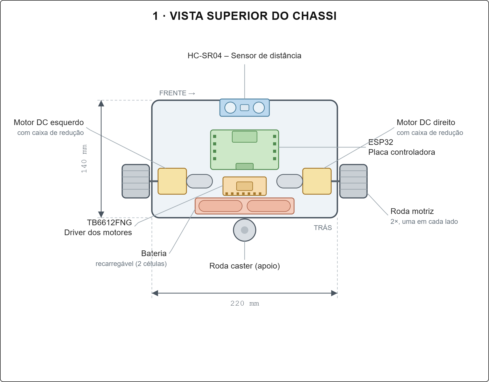
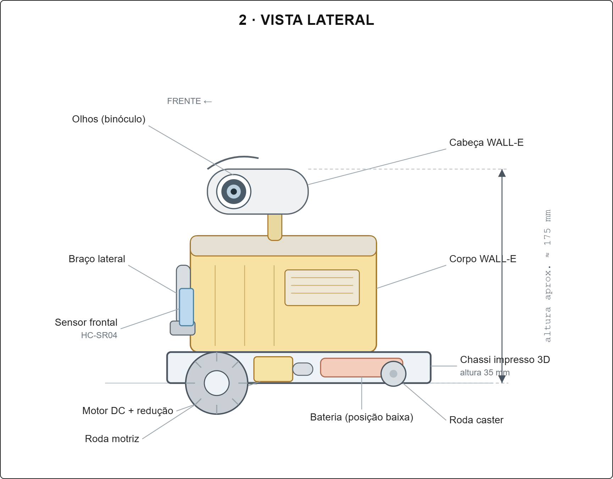
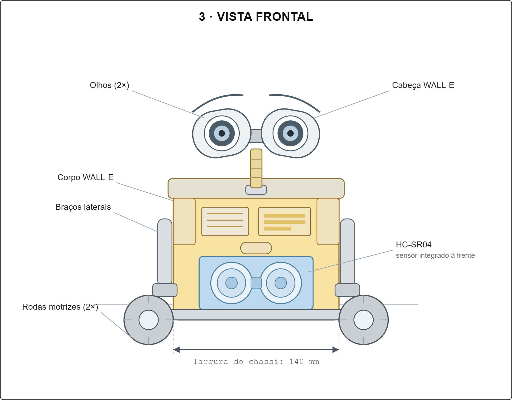
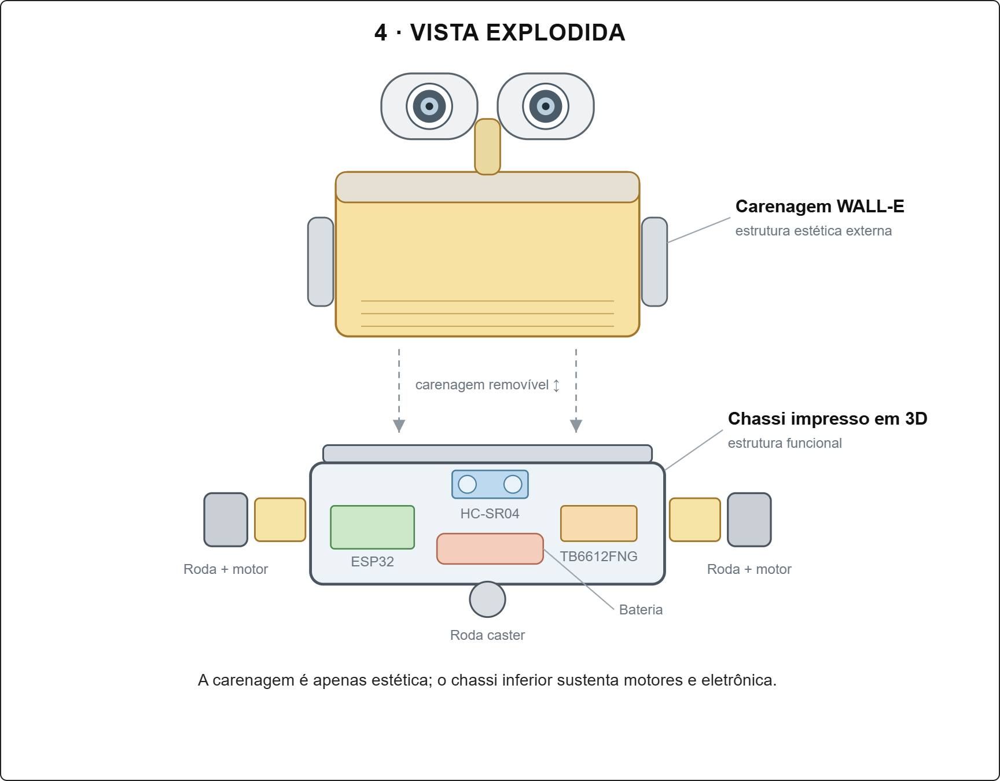

# Carrinho Robótico WALL-E — 4ESPY | CP1


Projeto de carrinho robótico físico, com chassi impresso em 3D e carenagem estética inspirada no personagem WALL-E (filme *WALL-E*, Pixar). O robô é controlado remotamente sem fio, movimenta-se por meio de dois motores DC e detecta obstáculos com um sensor de distância.

- **Turma:** 4ESPY
- **Avaliação:** CP1
- **Alunos:**
  - Julia Azevedo Lins — RM 98690
  - Luis Gustavo Barreto Garrido — RM 99210
  - Victor Hugo Aranda Forte — RM 99667
  - Felipe Cortez — RM 99750
  - Guilherme Akio — RM 98582
## Documentação

Toda a documentação técnica do projeto — descrição, objetivo, requisitos funcionais e físicos, especificações técnicas, lista de componentes, arquitetura do sistema, croqui do chassi e registros de montagem/testes — está no arquivo [`Documentacao.md`](Documentacao.md).

## O que já foi feito

- [x] Ficha de requisitos, requisitos funcionais e físicos, especificações técnicas e lista de componentes
- [x] Arquitetura geral do sistema e distribuição dos componentes no chassi
- [x] Croqui do chassi (vistas superior, lateral, frontal e explodida)
- [x] Diagrama de blocos e diagrama de alimentação, validados em montagem física de bancada
- [x] Definição e teste da pinagem entre Arduino/L298N/HC-SR04/HC-05
- [x] Teste de controle remoto sem fio via Bluetooth (HC-05 + app no celular) — funcionando
- [x] Teste de motores + sensor de aproximação (HC-SR04) — carrinho para automaticamente ao detectar obstáculo
- [x] Código-fonte dos testes (`Motor + Bluetooth.ino` e `Motor + Sensor de Aproximacao.ino`)

**Pendente:** migração da lógica testada para o ESP32 (placa definitiva), troca da bateria de teste por pilhas (alimentação definitiva), modelagem/impressão 3D final do chassi e confecção da carenagem.

## Croqui do chassi

| Vista superior | Vista lateral |
|---|---|
|  |  |

| Vista frontal | Vista explodida |
|---|---|
|  |  |

Demais vistas e o esquema textual completo estão detalhados na [documentação técnica](Documentacao.md).

## Estrutura do repositório

```
├── Documentacao.md               # documentação técnica completa
├── README.md                     # este arquivo
├── Motor + Bluetooth.ino         # código testado: motores + Bluetooth (HC-05)
├── Motor + Sensor de Aproximacao.ino  # código testado: motores + sensor HC-SR04
├── croqui/                       # imagens do croqui do chassi
├── imagens/                      # demais imagens do projeto (montagem, testes)
└── vídeo/                        # vídeos dos testes (Bluetooth e sensor)
```
